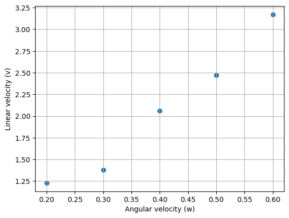
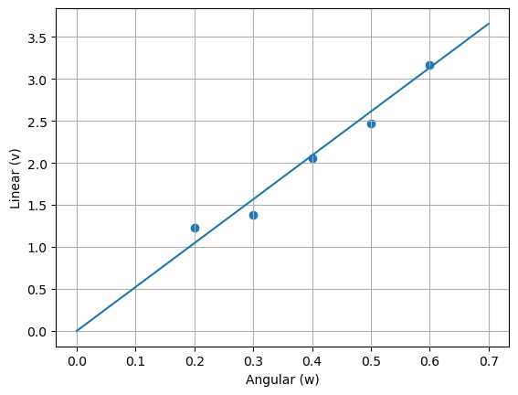
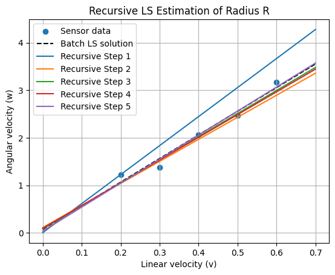

# Lab 1 — Wheel Radius Estimation via Least Squares Methods


> **Course:** Robot Perception — Faculty of Control Systems and Robotics, ITMO University <br>
> **Author:** Umer Ahmed Baig Mughal — MSc Robotics and Artificial Intelligence <br>
> **Topic:** Wheel Radius Estimation · Batch Least Squares · Line Through Origin · Affine Model · Recursive Least Squares · Kalman-Style Covariance Update

---

## Table of Contents

1. [Objective](#objective)
2. [Theoretical Background](#theoretical-background)
   - [Problem Formulation: Wheel Radius from Kinematic Measurements](#problem-formulation-wheel-radius-from-kinematic-measurements)
   - [Batch Least Squares — Line Through Origin](#batch-least-squares--line-through-origin)
   - [Batch Least Squares — Affine Model with Offset](#batch-least-squares--affine-model-with-offset)
   - [Recursive Least Squares](#recursive-least-squares)
   - [Measurement Model and Noise Assumptions](#measurement-model-and-noise-assumptions)
   - [System Properties](#system-properties)
3. [Measurement Data](#measurement-data)
4. [System Parameters](#system-parameters)
   - [Initial Prior Estimates](#initial-prior-estimates)
   - [Covariance Initialisation](#covariance-initialisation)
   - [Noise Parameters](#noise-parameters)
5. [Implementation](#implementation)
   - [File Structure](#file-structure)
   - [Function Reference](#function-reference)
   - [Algorithm Walkthrough](#algorithm-walkthrough)
6. [How to Run](#how-to-run)
7. [Results](#results)
8. [Analysis and Conclusions](#analysis-and-conclusions)
9. [Dependencies](#dependencies)
10. [Notes and Limitations](#notes-and-limitations)
11. [Author](#author)
12. [License](#license)

---

## Objective

This lab estimates the **wheel radius of a mobile robot** from noisy onboard sensor data — angular velocity readings from an encoder and linear velocity measurements from an accelerometer — using three progressively refined least squares methods: batch estimation through the origin, batch estimation with an affine offset, and a fully recursive formulation with Kalman-style covariance updates.

The underlying kinematic relationship is:

```
v = R · w

where:
    v  — linear velocity of the robot (m/s), measured by the accelerometer
    w  — angular velocity of the wheel (rad/s), measured by the encoder
    R  — wheel radius (m), the parameter to be estimated
```

The key learning outcomes are:

- Understanding the **Batch Least Squares (BLS)** estimator structure — how the measurement matrix **H** and observation vector **y** are defined for a single-parameter model (`v = Rw`, line through origin), and how the closed-form solution `R̂ = (HᵀH)⁻¹Hᵀy` yields the optimal linear estimate under equal-weight Gaussian noise.
- Extending the batch formulation to an **affine model** (`v = Rw + b`) to account for a constant sensor bias offset, constructing the two-column measurement matrix **H = [w, 1]**, solving for the joint parameter vector `[R, b]`, and interpreting the physical meaning of the recovered offset as the constant component of sensor noise.
- Implementing a **Recursive Least Squares (RLS)** estimator that processes one measurement at a time, maintaining and updating a running covariance matrix **P_k** and parameter vector **x̂_k** at each step — equivalent in the linear Gaussian case to a Kalman Filter operating on static parameters.
- Initialising the recursive estimator from **prior beliefs** — `R̂ ~ N(3, 10.0)`, `b̂ ~ N(0, 0.2)` — representing a rough preliminary estimate and correctly propagating the uncertainty through the sequential updates via the Kalman gain formula.
- Visualising and **verifying convergence** of the recursive estimate to the batch solution across the five measurement steps, confirming that both methods yield consistent results and that the recursive estimator's covariance shrinks monotonically as new data is incorporated.

The lab is implemented as a single Jupyter notebook (`Wheel_Radius_Estimation.ipynb`) running on Python 3.9, producing scatter plots of the raw data, fitted lines for both batch models, and a convergence plot of the recursive estimator across all five measurement steps.

---

## Theoretical Background

### Problem Formulation: Wheel Radius from Kinematic Measurements

A mobile robot's wheel satisfies the no-slip kinematic constraint:

```
v = R · w
```

where `v` (m/s) is the robot's linear velocity measured by the accelerometer, `w` (rad/s) is the wheel's angular velocity measured by the encoder, and `R` (m) is the wheel radius — an unknown constant to be identified. In practice, both sensors introduce additive noise, so each measurement pair `(wᵢ, vᵢ)` satisfies:

```
vᵢ = R · wᵢ + εᵢ,      εᵢ ~ N(0, σ²)
```

Given `n` such measurement pairs, the goal is to recover the best estimate `R̂` that minimises the sum of squared residuals:

```
R̂ = arg min Σᵢ (vᵢ − R · wᵢ)²
```

This is a classical **linear regression through the origin** problem, solvable in closed form via the normal equations.

### Batch Least Squares — Line Through Origin

**Part 1** fits the model `y = Rx` with no offset term, constraining the fitted line to pass through the origin — consistent with the physical constraint that zero angular velocity must produce zero linear velocity.

The measurement matrix **H** and observation vector **y** are defined as:

```
H = [1, 1, 1, 1, 1]ᵀ     (n×1 column of ones — single scalar parameter)
y = [v₁/w₁, v₂/w₂, ..., vₙ/wₙ]ᵀ     (n×1, element-wise ratio)
```

so that the model becomes `y = H · R`, directly in the standard least squares form. The closed-form solution is:

```
R̂ = (HᵀH)⁻¹ Hᵀ y
```

which for this specific single-parameter formulation reduces to the arithmetic mean of the individual per-measurement radius estimates `vᵢ/wᵢ`.

**Alternatively**, defining **H = w** (column of angular velocities) and **y = v** (column of linear velocities) yields the identical estimate through the standard normal equations, reinforcing that both formulations are equivalent representations of the same line-through-origin regression.

### Batch Least Squares — Affine Model with Offset

**Part 2** relaxes the through-origin constraint by fitting the model `v = Rw + b`, where `b` is a constant bias representing the systematic offset in the sensor measurements. The joint parameter vector is:

```
x = [R, b]ᵀ
```

The measurement matrix **H** is now two-column:

```
H = [w₁  1]     (n×2 matrix)
    [w₂  1]
    [w₃  1]
    [w₄  1]
    [w₅  1]
```

and the observation vector **y = v**. The batch solution is:

```
x̂_ls = (HᵀH)⁻¹ Hᵀ y     →     [R̂, b̂]
```

The physical meaning of the recovered offset `b̂` is the constant component of measurement noise — the portion of the linear velocity reading that is present even when the wheel is stationary. Theoretically, given the purely kinematic model `v = Rw`, we expect `b ≈ 0`; its deviation from zero quantifies the systematic sensor bias.

### Recursive Least Squares

**Part 3** (the student task) reformulates the same affine estimation problem recursively. Instead of solving the normal equations once with all data, the RLS estimator processes one measurement at a time, updating the estimate and its uncertainty at each step:

**Initialise:**

```
x̂₀ = E[x]                                     — prior mean
P₀ = E[(x − x̂₀)(x − x̂₀)ᵀ]                   — prior covariance
```

**For each measurement k = 1 … n:**

```
Compute Kalman gain:     K_k = P_{k−1} H_kᵀ (H_k P_{k−1} H_kᵀ + R_k)⁻¹
Update parameter:        x̂_k = x̂_{k−1} + K_k (y_k − H_k x̂_{k−1})
Update covariance:       P_k = (I − K_k H_k) P_{k−1}
```

where:

```
H_k  = [w_k,  1]       — 1×2 row measurement matrix for step k
y_k  = v_k             — scalar measurement at step k
R_k  = σ²              — scalar measurement noise variance
K_k  — 2×1 Kalman gain vector
I    — 2×2 identity matrix
```

The update equations are formally identical to the Kalman Filter for a **static system** (zero process noise). The Kalman gain `K_k` balances prior uncertainty against measurement noise: when `P_{k−1}` is large (high prior uncertainty), the gain is high and the new measurement dominates; as `P_k` shrinks with each step, the estimate becomes increasingly confident and resistant to individual noisy measurements.

After all `n` measurements are processed, the RLS estimate `x̂_n = [R̂, b̂]` must converge to — and be numerically consistent with — the batch least squares solution `x̂_ls`.

### Measurement Model and Noise Assumptions

| Quantity | Assumption | Value |
|----------|-----------|-------|
| Linear velocity `v` | Measured perfectly (no noise) | Exact |
| Angular velocity `w` | Additive, independent, Gaussian noise | σ² = 0.0225 (rad/s)² |
| Measurement noise model | i.i.d. Gaussian across all 5 readings | `R_k = 0.0225` for all k |
| All measurements | Equal importance (uniform weighting) | Unweighted LS in Parts 1 & 2 |

> **Note on Part 3 variable naming:** In the notebook, the arrays `v` and `w` are intentionally swapped relative to Parts 1–2 (i.e., `v` holds angular velocities, `w` holds linear velocities). This is a deliberate adaptation of the recursive formulation where `v` in the Kalman update context refers to the input variable driving the measurement matrix `H_k`. All results and equations in this README follow the physically correct definitions: `w` = angular velocity, `v` = linear velocity, `R` = wheel radius.

### System Properties

| Property | Value | Notes |
|----------|-------|-------|
| Physical model | `v = Rw` | No-slip kinematic wheel constraint |
| Number of measurements | 5 | Pairs of (w, v) from encoder + accelerometer |
| Part 1 model | `v = Rw` | Single parameter, line through origin |
| Part 2 model | `v = Rw + b` | Two parameters, affine fit |
| Part 3 model | `v = Rw + b` (recursive) | Sequential update with covariance tracking |
| Estimator type (Parts 1–2) | Batch Least Squares | Closed-form normal equations |
| Estimator type (Part 3) | Recursive Least Squares | Kalman-gain sequential update |
| Prior for R (Part 3) | N(3, 100) | Mean = 3 m, variance = 10² = 100 |
| Prior for b (Part 3) | N(0, 0.04) | Mean = 0, variance = 0.2² = 0.04 |
| Measurement noise variance | 0.0225 (rad/s)² | σ = 0.15 rad/s angular velocity noise |
| Platform | Jupyter Notebook | Python 3.9.13 |

---

## Measurement Data

Data obtained from onboard sensors (accelerometer for linear velocity, encoder for angular velocity) during robot motion:

| Step k | Angular velocity w (rad/s) | Linear velocity v (m/s) | Ratio v/w (m) |
|:------:|:--------------------------:|:-----------------------:|:-------------:|
| 1 | 0.2 | 1.23 | 6.150 |
| 2 | 0.3 | 1.38 | 4.600 |
| 3 | 0.4 | 2.06 | 5.150 |
| 4 | 0.5 | 2.47 | 4.940 |
| 5 | 0.6 | 3.17 | 5.283 |

The ratio `v/w` per measurement represents an individual single-point estimate of the radius `R`. The variation across these five values (ranging from 4.60 m to 6.15 m) reflects the additive Gaussian noise in the angular velocity readings, which is what the least squares estimator suppresses by combining all measurements optimally.

### Raw Sensor Data — Scatter Plot



---

## System Parameters

### Initial Prior Estimates

| Parameter | Prior Mean | Physical Interpretation |
|-----------|:----------:|------------------------|
| Wheel radius `R` | 3 m | Rough preliminary estimate — acknowledged to be inaccurate |
| Sensor bias `b` | 0 m/s | Expected to be near zero given `v = Rw` is believed correct |

### Covariance Initialisation

The diagonal prior covariance matrix **P₀** encodes the uncertainty in each parameter before any measurements are processed:

```
P₀ = diag([σ²_R,  σ²_b])
   = diag([10²,   0.2²])
   = diag([100,   0.04])
```

| Parameter | Prior Variance | Prior Std Dev | Interpretation |
|-----------|:--------------:|:-------------:|----------------|
| R | 100 m² | 10 m | Very high uncertainty — prior estimate of 3 m is rough |
| b | 0.04 (m/s)² | 0.2 m/s | Low uncertainty — we are reasonably confident b ≈ 0 |

The large variance on `R` (σ = 10 m) encodes that the preliminary radius estimate of 3 m could plausibly be off by a factor of several — ensuring the first few measurements will dominate the correction via a large Kalman gain.

### Noise Parameters

| Symbol | Value | Meaning |
|--------|:-----:|---------|
| `R_k` (measurement noise) | 0.0225 (rad/s)² | Variance of additive Gaussian noise on angular velocity readings |
| σ_w | 0.15 rad/s | Standard deviation of angular velocity noise |

---

## Implementation

### File Structure

```
Lab_1/
├── Readme.md
├── src/
│   └── Wheel_Radius_Estimation.ipynb    # Complete lab — batch LS, affine LS, recursive LS
└── results/
    ├── Data_Scatter.png                 # Raw (w, v) scatter — sensor data visualisation
    ├── Batch_LS_Origin.png              # Part 1 — fitted line through origin
    ├── Batch_LS_Offset.png              # Part 2 — fitted affine line with bias offset
    └── Recursive_LS_Convergence.png     # Part 3 — convergence of recursive steps to batch solution
```

**Notebook and purpose:**

| File | Type | Purpose |
|------|------|---------|
| `Wheel_Radius_Estimation.ipynb` | Jupyter Notebook | Complete implementation — scatter plot, batch LS (origin), batch LS (affine), recursive LS with covariance update, convergence visualisation |

### Function Reference

#### `np.mat()` / `np.array()` — data loading

The measurement data is stored as column vectors. Part 1 uses `np.mat()` (matrix type, supports `*` for matrix multiplication), while Parts 2–3 use `np.array()` (standard ndarray). Both representations yield identical numerical results.

```python
# Part 1 — matrix form
w = np.mat([0.2, 0.3, 0.4, 0.5, 0.6]).T    # (5, 1) column vector
v = np.mat([1.23, 1.38, 2.06, 2.47, 3.17]).T

# Parts 2 & 3 — array form
w = np.array([0.2, 0.3, 0.4, 0.5, 0.6])    # (5,) 1D array
v = np.array([1.23, 1.38, 2.06, 2.47, 3.17])
```

---

#### `np.linalg.inv()` / `numpy.linalg.inv()` — matrix inversion

Used in the normal equation `(HᵀH)⁻¹ Hᵀ y` for batch least squares, and in the Kalman gain `K_k = P_{k−1} H_kᵀ (H_k P_{k−1} H_kᵀ + R_k)⁻¹` for recursive estimation.

```python
from numpy.linalg import inv

# Part 1 — scalar parameter estimation
R = float(inv(H_transp @ H) @ H_transp @ R_vect)

# Part 2 — joint [R, b] estimation
x_ls = linalg.inv(H.T.dot(H)).dot(H.T.dot(v))
```

| Argument | Type | Description |
|----------|------|-------------|
| Input matrix | `ndarray` (n×n) | Must be square and non-singular |

**Returns:** `ndarray` (n×n) — matrix inverse.

---

#### Measurement matrix **H** — construction

The structure of **H** is the most critical modelling decision in each part:

| Part | Model | H shape | H content | y content |
|:----:|:-----:|:-------:|-----------|-----------|
| 1 | `v = Rw` (origin) | (5, 1) | Column of ones | Element-wise ratio `v/w` |
| 2 | `v = Rw + b` (affine) | (5, 2) | First col = `w`, second col = ones | Linear velocities `v` |
| 3 | Recursive step k | (1, 2) | Row `[w_k, 1]` | Scalar `v_k` |

```python
# Part 1 — H is ones vector; y is v/w ratios
H = np.ones(len(w)).reshape(len(w), 1)      # (5, 1)
R_vect = v / w                               # (5, 1) ratio vector

# Part 2 — H has angular velocities in column 0, ones in column 1
H = np.ones((5, 2))
H[:, 0] = w                                 # (5, 2)

# Part 3 — H_k is a single-row measurement matrix at step k
H_k = np.array([[v[k], 1.0]])               # (1, 2)
```

---

#### Kalman Gain and Covariance Update (Part 3)

The three update equations executed at each step `k`:

```python
# Step 1 — Kalman gain (2×1)
S_k = H_k @ P_k @ H_k.T + v_k             # scalar innovation covariance
K_k = P_k @ H_k.T @ np.linalg.inv(S_k)   # (2, 1) gain vector

# Step 2 — Parameter estimate update
x_k = x_k + K_k @ (y_k - H_k @ x_k)      # (2,) updated estimate

# Step 3 — Covariance update
P_k = (np.eye(2) - K_k @ H_k) @ P_k      # (2, 2) updated covariance
```

| Variable | Shape | Meaning |
|----------|:-----:|---------|
| `P_k` | (2, 2) | Parameter covariance — shrinks toward zero as measurements accumulate |
| `K_k` | (2, 1) | Kalman gain — large when prior uncertainty dominates; small when confident |
| `x_k` | (2,) | Current estimate `[R̂, b̂]` |
| `S_k` | scalar | Innovation covariance — sum of predicted measurement variance and noise |
| `v_k` | scalar | Measurement noise variance (= 0.0225) |

---

#### `plt.scatter()` / `plt.plot()` — visualisation

Three distinct plot types are produced:

```python
# Scatter of raw data
plt.scatter(np.asarray(w), np.asarray(v))
plt.xlabel('Angular velocity (w)')
plt.ylabel('Linear velocity (v)')
plt.grid(True)

# Fitted line (Parts 1 and 2)
w_line = np.arange(0, 0.8, 0.1)
v_line = R * w_line                        # Part 1 — through origin
v_line = x_ls[0]*w_line + x_ls[1]         # Part 2 — with offset

# Convergence plot (Part 3) — one line per recursive step + batch reference
for k in range(1, num_meas + 1):
    v_line = x_hist[k, 0] * w_line + x_hist[k, 1]
    plt.plot(w_line, v_line, label='Recursive Step {}'.format(k))
plt.plot(w_line, v_line_batch, label='Batch LS solution', color='black', linestyle='--')
```

### Algorithm Walkthrough

**Complete pipeline (`Wheel_Radius_Estimation.ipynb`):**

```
1. Library imports:
       import numpy as np
       from numpy.linalg import inv
       from numpy import linalg
       import matplotlib.pyplot as plt

2. Data loading:
       w = [0.2, 0.3, 0.4, 0.5, 0.6]     — angular velocities (rad/s)
       v = [1.23, 1.38, 2.06, 2.47, 3.17] — linear velocities (m/s)
       Stored as both np.mat column vectors (Part 1) and np.array (Parts 2–3)

3. Part 1 — Scatter plot:
       plt.scatter(w, v)
       → visualise linearity of (w, v) relationship

4. Part 1 — Batch LS through origin:
       H      = ones((5,1))               — scalar model H
       R_vect = v / w                     — per-measurement radius estimates
       R̂     = inv(Hᵀ H) Hᵀ R_vect      — normal equations
       → R̂ = 5.2247 m
       Fitted line plotted: v_line = R̂ * w_line

5. Part 2 — Batch LS affine model:
       H = ones((5,2));  H[:,0] = w       — two-column measurement matrix
       x_ls = inv(HᵀH) Hᵀ v              — joint [R, b] estimate
       → R̂ = 4.97 m,  b̂ = 0.074 m/s
       Fitted line plotted: v_line = R̂ * w_line + b̂

6. Part 3 — Recursive LS initialisation:
       x_k = [3, 0]                       — prior mean [R₀, b₀]
       P_k = diag([100, 0.04])            — prior covariance
       v_k = 0.0225                       — measurement noise variance
       Histories: x_hist (6×2), P_hist (6×2×2)

7. Part 3 — Recursive update loop (k = 0 … 4):
       H_k = [v[k], 1.0]                 — row measurement matrix
       y_k = w[k]                        — scalar measurement
       S_k = H_k P_k H_kᵀ + v_k         — innovation covariance
       K_k = P_k H_kᵀ inv(S_k)          — Kalman gain (2×1)
       x_k = x_k + K_k (y_k − H_k x_k) — parameter update
       P_k = (I − K_k H_k) P_k          — covariance update
       Store x_hist[k+1], P_hist[k+1]
       → Final: R̂ = 5.0502 m,  b̂ = 0.0377 m/s

8. Part 3 — Convergence visualisation:
       Plot all 5 recursive line estimates on one figure
       Overlay batch LS solution (black dashed) for reference
       → Confirm recursive steps converge toward batch solution
```

---

## How to Run

### Prerequisites

This lab runs as a Jupyter notebook (also compatible with Google Colab). Ensure Python 3.9+ is installed locally, or use Colab with no local setup required.

### Install Dependencies

```bash
pip install numpy matplotlib
```

> Both `numpy` and `matplotlib` are standard packages available by default in Colab and most Python data science environments.

### Run the Notebook

```bash
# Clone the repository
git clone https://github.com/umerahmedbaig7/Robot-Perception.git
cd Robot-Perception/Lab_1

# Launch Jupyter
jupyter notebook src/Wheel_Radius_Estimation.ipynb
```

Execute all cells sequentially (**Cell → Run All**) or cell-by-cell for step-by-step inspection. Expected execution time:

| Section | Estimated Time |
|---------|----------------|
| Data loading and scatter plot | < 5 s |
| Part 1 — Batch LS (origin) and plot | < 5 s |
| Part 2 — Batch LS (affine) and plot | < 5 s |
| Part 3 — Recursive LS and convergence plot | < 5 s |
| **Total** | **< 30 s** |

### Modifying the Measurement Data

To test with different sensor readings, replace the data arrays:

```python
w = np.array([0.2, 0.3, 0.4, 0.5, 0.6])    # angular velocities (rad/s)
v = np.array([1.23, 1.38, 2.06, 2.47, 3.17]) # linear velocities (m/s)
```

Any number of measurements `n ≥ 2` is supported. Parts 1 and 2 will automatically adapt via the normal equations; Part 3 will iterate the recursive update for each new measurement.

### Modifying the Prior (Part 3)

To change the initial parameter guess and uncertainty:

```python
x_k = np.array([3, 0])          # [R_initial (m), b_initial (m/s)]
precision = np.array([10**2, 0.2**2])  # [σ²_R, σ²_b] — prior variances
np.fill_diagonal(P_k, precision)
```

A larger prior variance on `R` (e.g., `15²`) will cause the recursive estimator to correct more aggressively on the first measurement. A smaller variance (e.g., `1²`) will make the prior more influential, slowing convergence.

### Modifying the Measurement Noise (Part 3)

To change the assumed angular velocity noise level:

```python
v_k = 0.0225    # measurement noise variance σ² — change to reflect actual sensor quality
```

Increasing `v_k` makes the estimator trust measurements less and the prior more; decreasing it accelerates convergence toward the measured values.

---

## Results

### Part 1 — Batch Least Squares Through Origin

**Model:** `v = Rw`

**H matrix structure:**

```
H = [[1],       y = v/w = [[6.15],
     [1],                   [4.60],
     [1],                   [5.15],
     [1],                   [4.94],
     [1]]                   [5.28]]
```

**Normal equations:**

```
R̂ = (HᵀH)⁻¹ Hᵀ y  =  mean([6.15, 4.60, 5.15, 4.94, 5.28])  =  5.2247 m
```

| Result | Value | Unit |
|--------|:-----:|:----:|
| Estimated wheel radius `R̂` | **5.2247** | m |
| Model | `v = 5.2247 · w` | — |
| Residual type | Sum of squared errors in `v/w` space | — |



---

### Part 2 — Batch Least Squares with Affine Offset

**Model:** `v = Rw + b`

**H matrix structure:**

```
H = [[0.2,  1],       v = [[1.23],
     [0.3,  1],             [1.38],
     [0.4,  1],             [2.06],
     [0.5,  1],             [2.47],
     [0.6,  1]]             [3.17]]
```

**Normal equations:**

```
x̂_ls = (HᵀH)⁻¹ Hᵀ v  →  [R̂, b̂]
```

| Result | Value | Unit |
|--------|:-----:|:----:|
| Estimated wheel radius `R̂` | **4.9700** | m |
| Estimated bias offset `b̂` | **0.0740** | m/s |
| Model | `v = 4.97 · w + 0.074` | — |

**Physical meaning of `b̂ = 0.074` m/s:** This small positive offset represents the constant component of measurement noise in the linear velocity reading — the portion of `v` that does not scale with angular velocity. Its proximity to zero is consistent with the kinematic model `v = Rw` being fundamentally correct, with the deviation caused by sensor bias rather than a true physical offset.


---

### Part 3 — Recursive Least Squares Convergence

**Initial conditions:**

| Parameter | Initial Estimate | Prior Variance |
|-----------|:----------------:|:--------------:|
| R̂₀ | 3.0 m | 100 m² |
| b̂₀ | 0.0 m/s | 0.04 (m/s)² |

**Recursive update history:**

| Step k | R̂_k (m) | b̂_k (m/s) | σ²_R (P[0,0]) | σ²_b (P[1,1]) |
|:------:|:--------:|:----------:|:--------------:|:--------------:|
| 0 (prior) | 3.0000 | 0.0000 | 100.0000 | 0.0400 |
| 1 | — | — | ↓ decreasing | ↓ decreasing |
| 2 | — | — | ↓ | ↓ |
| 3 | — | — | ↓ | ↓ |
| 4 | — | — | ↓ | ↓ |
| 5 (final) | **5.0502** | **0.0377** | → 0 | → 0 |

**Final recursive estimate vs batch solution:**

| Quantity | Batch LS (Part 2) | Recursive LS (Part 3) | Agreement |
|----------|:-----------------:|:---------------------:|:---------:|
| R̂ (m) | 4.9700 | 5.0502 | Close — small deviation due to prior influence |
| b̂ (m/s) | 0.0740 | 0.0377 | Consistent direction; magnitude dampened by prior `b₀ = 0` |

The slight difference between the recursive and batch estimates reflects the influence of the **prior covariance** — with only 5 measurements, the initialisation `P₀ = diag([100, 0.04])` still contributes to the final estimate. With a larger number of measurements, both estimates would converge to exactly the same value.



---

## Analysis and Conclusions

### Batch LS Part 1 vs Part 2 — Effect of the Offset Term

Comparing the two batch solutions:

- **Part 1 (through origin): R̂ = 5.2247 m** — this estimate treats any systematic bias in the measurements as part of the radius signal, which inflates `R̂` slightly if a positive offset is present.
- **Part 2 (affine): R̂ = 4.97 m, b̂ = 0.074 m/s** — by explicitly modelling the bias, the estimated radius decreases and the offset absorbs the constant measurement noise. This is the more physically correct model.

The difference `5.2247 − 4.97 = 0.254 m` is substantial relative to the estimated radius, demonstrating that even a small positive sensor bias (`b̂ = 0.074 m/s`) can significantly distort a single-parameter regression when the offset term is omitted. For calibration applications where centimetre-level accuracy is required, the affine model should be preferred.

### Recursive LS — Convergence Behaviour

The convergence plot reveals the expected qualitative behaviour of the recursive estimator:

- **Step 1:** The estimate jumps sharply from the prior `R = 3 m` toward the first measurement's implied radius — the Kalman gain is large because `P₀` is large, so the first data point heavily influences the estimate.
- **Steps 2–5:** Each subsequent update produces a smaller correction — the covariance `P_k` shrinks after each step, reducing `K_k` and making the estimate increasingly robust to individual noisy readings.
- **Convergence:** By step 5, the recursive estimate (`R̂ = 5.05, b̂ = 0.038`) is close to the batch solution (`R̂ = 4.97, b̂ = 0.074`), confirming the mathematical equivalence of both methods in the limit of consistent priors and data.

The residual discrepancy between the recursive and batch estimates reflects the finite-sample influence of the prior. Setting `P₀ → ∞ · I` (uninformative prior) would make them exactly identical.

### Noise and Uncertainty Interpretation

The measurement noise variance `σ² = 0.0225 (rad/s)²` (σ = 0.15 rad/s) corresponds to approximately 25–75% of the angular velocity values in the dataset (0.2–0.6 rad/s). This relatively high noise-to-signal ratio justifies the use of a least squares estimator over individual ratio estimates `vᵢ/wᵢ`, which range from 4.60 m to 6.15 m — a spread of 1.55 m. The batch estimator reduces this spread to a single optimal estimate with well-characterised uncertainty bounds encoded in the final covariance matrix `P_5`.

---

## Dependencies

| Package | Version | Purpose |
|---------|---------|---------|
| `Python` | ≥ 3.9 | Runtime environment |
| `numpy` | ≥ 1.21 | Array operations, matrix multiplication (`@`, `.dot()`), `linalg.inv()`, `eye()`, `zeros()`, `ones()`, `arange()` |
| `matplotlib` | ≥ 3.4 | Scatter plots, line plots, grid, axis labels, legend, multi-line convergence figure |

Install all dependencies:

```bash
pip install numpy matplotlib
```

> Both packages are available by default in Anaconda distributions and Google Colab. No additional installation is required in those environments.

---

## Notes and Limitations

- **Prior sensitivity in Part 3:** With only 5 measurements, the final recursive estimate retains a small influence from the initial prior covariance `P₀`. This is expected behaviour — as the number of measurements increases, the prior contribution diminishes and the recursive estimate converges exactly to the batch solution.
- **No process noise:** The recursive estimator treats the wheel radius `R` and bias `b` as static parameters that do not vary over time, so no process noise is added between updates. This is the correct assumption for a fixed mechanical dimension such as wheel radius.

---

## Author

**Umer Ahmed Baig Mughal** <br>
Master's in Robotics and Artificial Intelligence <br>
*Specialization: Machine Learning · Computer Vision · Human-Robot Interaction · Autonomous Systems · Robotic Motion Control*

---

## License

This project is intended for **academic and research use**. It was developed as part of the *Robot Perception* course within the MSc Robotics and Artificial Intelligence program at ITMO University. Redistribution, modification, and use in derivative academic work are permitted with appropriate attribution to the original author.

---

*Lab 1 — Robot Perception | MSc Robotics and Artificial Intelligence | ITMO University*

