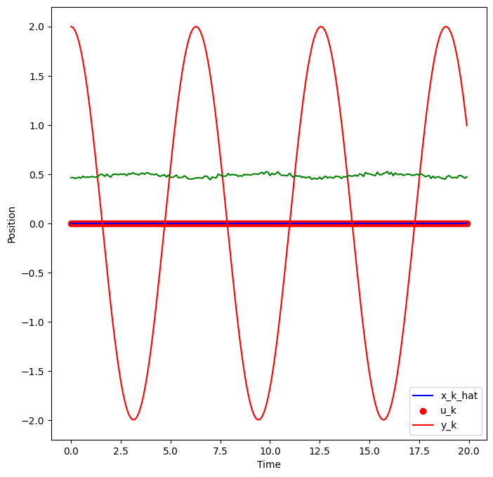
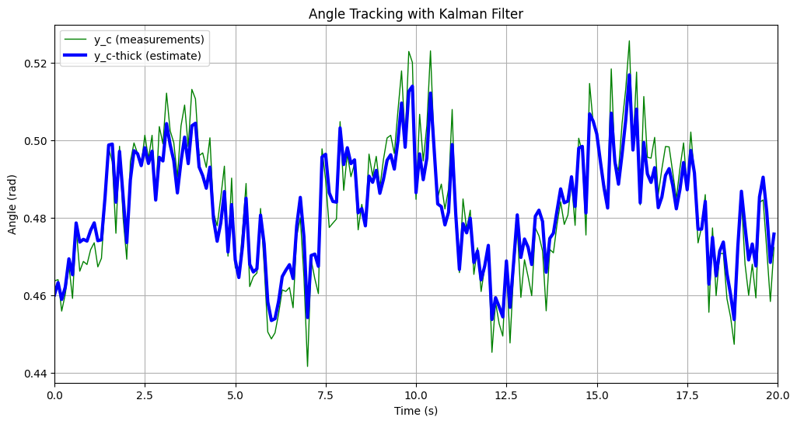

# Lab 2 — 1D Position Estimation via Extended Kalman Filter


> **Course:** Robot Perception — Faculty of Control Systems and Robotics, ITMO University <br>
> **Author:** Umer Ahmed Baig Mughal — MSc Robotics and Artificial Intelligence <br>
> **Topic:** Extended Kalman Filter · Non-linear Measurement Model · Jacobian Linearisation · Landmark Angle Sensing · Prediction-Update Cycle · Covariance Propagation

---

## Table of Contents

1. [Objective](#objective)
2. [Theoretical Background](#theoretical-background)
   - [Problem Formulation: 1D Position Estimation from Angle Measurements](#problem-formulation-1d-position-estimation-from-angle-measurements)
   - [State Space Representation](#state-space-representation)
   - [Linear Motion Model](#linear-motion-model)
   - [Non-linear Measurement Model](#non-linear-measurement-model)
   - [EKF Linearisation — Jacobians](#ekf-linearisation--jacobians)
   - [Extended Kalman Filter Equations](#extended-kalman-filter-equations)
   - [System Properties](#system-properties)
3. [System Parameters](#system-parameters)
   - [Initial State and Covariance](#initial-state-and-covariance)
   - [Motion Model Parameters](#motion-model-parameters)
   - [Measurement and Environment Parameters](#measurement-and-environment-parameters)
   - [Optional Extension Parameters](#optional-extension-parameters)
4. [Implementation](#implementation)
   - [File Structure](#file-structure)
   - [Function Reference](#function-reference)
   - [Algorithm Walkthrough](#algorithm-walkthrough)
5. [How to Run](#how-to-run)
6. [Results](#results)
7. [Analysis and Conclusions](#analysis-and-conclusions)
8. [Dependencies](#dependencies)
9. [Notes and Limitations](#notes-and-limitations)
10. [Author](#author)
11. [License](#license)

---

## Objective

This lab implements an **Extended Kalman Filter (EKF)** to estimate the 1D position of a moving robot using angle measurements from a camera observing a distant landmark. Unlike the standard Kalman Filter — which requires both the motion and measurement models to be linear — the EKF handles the **non-linear measurement model** arising from the geometry of perspective projection: the camera measures the elevation angle to the landmark, which is a trigonometric (arctangent) function of position.

The motion model remains the standard linear constant-acceleration kinematic model, while the measurement model is linearised at each step by computing its **Jacobian** with respect to the current predicted state — the defining characteristic of the Extended Kalman Filter approach.

The key learning outcomes are:

- Understanding the structural difference between a standard Kalman Filter and an EKF — specifically, why the EKF is necessary when the measurement function `h(x)` is non-linear in the state, and how first-order Taylor expansion (Jacobian linearisation) makes the standard Kalman update equations applicable in such cases.
- Constructing the **state transition matrix F** and **control influence matrix G** for a constant-acceleration kinematic model in discrete time, and propagating both the state estimate and covariance through the prediction step.
- Deriving and computing the **measurement Jacobian H_k** — the partial derivative of the arctangent measurement function with respect to the predicted position state — and understanding how its value changes as the robot's predicted position `p̌_k` approaches the landmark distance `D`.
- Applying the complete **EKF prediction-update cycle** for a single time step: propagating the prior state and covariance through the motion model, computing the Kalman gain from the linearised measurement Jacobian, and correcting both the state estimate and covariance using the actual angle measurement.
- Extending the single-step EKF into a **full recursive filter over a 20-second trajectory** (optional part), running the prediction and measurement update at every time step across 200 samples and visualising the estimated angle track against the raw noisy measurements.

The lab is implemented as a single Jupyter notebook (`Landmark_Angle_EKF.ipynb`) running on Python 3.9, producing numerical outputs for the single-step EKF (predicted covariance, Kalman gain, updated state and covariance) and a time-series plot for the optional extended trajectory estimation.

---

## Theoretical Background

### Problem Formulation: 1D Position Estimation from Angle Measurements

A robot moves along a 1D track. A camera mounted on the robot observes a stationary landmark of known height `S` located at a known horizontal distance `D` from the origin in the global coordinate system. As the robot moves to position `p`, the angle `φ` subtended by the landmark above the horizon changes according to:

```
φ = arctan( S / (D − p) )
```

This is the **observation equation** — it maps the robot's position `p` (part of the state vector) to the measured quantity `φ` (the camera output). Because it involves a trigonometric function of the state, the measurement model is **non-linear**, and a standard (linear) Kalman Filter cannot be applied directly. The EKF resolves this by linearising the measurement function around the current predicted state at each time step.

The geometry of the problem is shown below: the robot at position `p` observes the landmark at `(D, S)` and measures the angle between the horizontal and the line of sight to the top of the landmark.

### State Space Representation

The robot's state is described by its position and velocity along the 1D track:

```
x = [p,  ṗ]ᵀ

where:
    p   — position of the robot along the track (m)
    ṗ   — velocity of the robot (m/s)
```

The control input is the robot's acceleration:

```
u = a = p̈     (m/s²)
```

### Linear Motion Model

The motion model is the standard **constant-acceleration kinematic model** in discrete time. Since this model is already linear in the state, no linearisation is required for the prediction step — the standard Kalman prediction equations apply directly:

```
x_k = f(x_{k−1}, u_{k−1}, w_{k−1})
    = F · x_{k−1} + G · u_{k−1} + w_{k−1}

where:
    F = [[1,  Δt],      — State transition matrix
         [0,   1]]

    G = [[0 ],          — Control influence matrix
         [Δt]]

    w_{k−1} ~ N(0, Q)  — Process noise
    Q = 0.1 · I₂ₓ₂     — Process noise covariance (isotropic)
```

The state transition matrix `F` encodes the kinematic relations `p_k = p_{k−1} + ṗ_{k−1} · Δt` and `ṗ_k = ṗ_{k−1}`, while `G · u` adds the effect of known acceleration input over the time step.

### Non-linear Measurement Model

The measurement model maps the state to the observed angle:

```
y_k = φ_k = h(p_k, v_k)
           = arctan( S / (D − p_k) ) + v_k

where:
    S    — landmark height (m), known constant
    D    — landmark horizontal position in global frame (m), known constant
    p_k  — robot position (first element of state x_k)
    v_k  — measurement noise,  v_k ~ N(0, R),  R = 0.01
```

Because `h(·)` is a non-linear function of `p_k`, the EKF linearises it around the predicted state `x̌_k` at each update step.

### EKF Linearisation — Jacobians

The EKF replaces the non-linear functions with their first-order Taylor expansions, evaluated at the current operating point. This requires four Jacobian matrices:

**Jacobian of the motion model with respect to the state `F_{k−1}`:**

```
F_{k−1} = ∂f/∂x |_{x̂_{k−1}, u_{k−1}, 0}
         = [[1,  Δt],
            [0,   1]]
```

Since the motion model is already linear, `F_{k−1}` equals the state transition matrix `F` — no approximation is introduced in the prediction step.

**Jacobian of the motion model with respect to process noise `L_{k−1}`:**

```
L_{k−1} = ∂f/∂w |_{x̂_{k−1}, u_{k−1}, 0}
         = I₂ₓ₂     (2×2 identity matrix)
```

**Jacobian of the measurement model with respect to the state `H_k`:**

```
H_k = ∂h/∂x |_{x̌_k, 0}
    = [ S / ((D − p̌_k)² + S²),   0 ]       (1×2 row vector)
```

This is the critical linearisation. The derivative of `arctan(S / (D − p))` with respect to `p` is obtained by the chain rule, yielding `S / ((D − p)² + S²)`. The second element is zero because the measurement does not depend on velocity `ṗ`. The Jacobian changes at every step because it depends on the predicted position `p̌_k`.

**Jacobian of the measurement model with respect to measurement noise `M_k`:**

```
M_k = ∂h/∂v |_{x̌_k, 0}  =  1     (scalar)
```

### Extended Kalman Filter Equations

The EKF executes a two-step cycle at each time step `k`:

**Step 1 — Prediction (using linearised motion model):**

```
Predicted state:       x̌_k = F · x̂_{k−1} + G · u_{k−1}
Predicted covariance:  P̌_k = F_{k−1} · P̂_{k−1} · F_{k−1}ᵀ + L_{k−1} · Q · L_{k−1}ᵀ
                            = F · P̂_{k−1} · Fᵀ + Q
```

**Step 2 — Measurement Update (using linearised measurement model):**

```
Predicted measurement:   ŷ_k = h(x̌_k) = arctan( S / (D − p̌_k) )

Innovation covariance:   S_k = H_k · P̌_k · H_kᵀ + M_k · R · M_kᵀ

Kalman gain:             K_k = P̌_k · H_kᵀ · S_k⁻¹

Updated state:           x̂_k = x̌_k + K_k · (y_k − ŷ_k)

Updated covariance:      P̂_k = (I − K_k · H_k) · P̌_k
```

The innovation `(y_k − ŷ_k)` is the difference between the actual angle measurement and the angle predicted from the propagated state. The Kalman gain `K_k` determines what fraction of this angular residual is used to correct the position and velocity estimates.

### System Properties

| Property | Value | Notes |
|----------|-------|-------|
| State dimension | 2 | Position `p` and velocity `ṗ` |
| Measurement dimension | 1 | Scalar angle `φ` (rad) |
| Motion model | Linear | Constant-acceleration kinematics |
| Measurement model | Non-linear | `arctan(S / (D − p))` |
| Linearisation method | First-order Jacobian | Evaluated at predicted state each step |
| Filter type | Extended Kalman Filter | Standard EKF formulation |
| Time step (main task) | Δt = 0.5 s | Single-step demonstration |
| Time step (optional) | Δt = 0.1 s | Full 20-second trajectory |
| Number of steps (optional) | N = 200 | `t ∈ [0, 20)` s |
| Landmark height | S = 20 m | Known, fixed |
| Landmark position | D = 40 m | Known, fixed in global frame |
| Platform | Jupyter Notebook | Python 3.9.13 |

---

## System Parameters

### Initial State and Covariance

```
x̂_0 = [0,  5]ᵀ     — initial position = 0 m, initial velocity = 5 m/s

P̂_0 = [[0.01,  0 ],  — initial covariance
        [ 0,    1 ]]
```

| Parameter | Value | Meaning |
|-----------|:-----:|---------|
| Initial position `p₀` | 0 m | Robot starts at the origin |
| Initial velocity `ṗ₀` | 5 m/s | Robot moving toward the landmark |
| Position uncertainty `σ²_p` | 0.01 m² | High confidence in initial position |
| Velocity uncertainty `σ²_ṗ` | 1.0 (m/s)² | Moderate confidence in initial velocity |

### Motion Model Parameters

| Symbol | Value | Description |
|--------|:-----:|-------------|
| `F` | `[[1, Δt], [0, 1]]` | State transition matrix |
| `G` | `[[0], [Δt]]` | Control influence matrix |
| `Q` (= `w_k`) | `0.1 · I₂ₓ₂` | Process noise covariance |
| `Δt` (main task) | 0.5 s | Discrete time step |
| `u_0` | −2 m/s² | Control input — decelerating |

### Measurement and Environment Parameters

| Symbol | Value | Description |
|--------|:-----:|-------------|
| `y_1` | π/6 rad (≈ 0.5236 rad) | First angle measurement |
| `R` (= `v_k`) | 0.01 rad² | Measurement noise covariance |
| `M_k` | 1 | Measurement noise Jacobian (scalar) |
| `S` | 20 m | Landmark height above ground |
| `D` | 40 m | Landmark horizontal position in global frame |

### Optional Extension Parameters

| Parameter | Value | Description |
|-----------|:-----:|-------------|
| `Δt` | 0.1 s | Finer time discretisation |
| `t_time` | `[0, 20)` s | Full simulation time window |
| `N` | 200 | Total number of time steps |
| `u_k` | `cos(t) · 0.5` m/s² | Time-varying sinusoidal control input |
| `Q` | `diag([0.01, 0.05])` | Tuned process noise covariance |
| `R_k` | 0.005 rad² | Tuned measurement noise covariance |
| `x̂_0` (optional) | `[[0.46], [0]]` | Initial angle state near first measurement |
| `P̂_0` (optional) | `diag([0.01, 0.1])` | Tight initial covariance |
| `y_k` | 200-element array | Pre-recorded angle measurements (rad) |

---

## Implementation

### File Structure

```
Lab_2/
├── Readme.md
├── src/
│   └── Landmark_Angle_EKF.ipynb        # Complete lab — EKF single step + optional full trajectory
└── results/
    ├── EKF_Single_Step.png             # Numerical results — predicted P_k, K_k, updated state and covariance
    └── EKF_Angle_Tracking.png          # Optional — angle estimate vs raw measurements over 20 s
```

**Notebook and purpose:**

| File | Type | Purpose |
|------|------|---------|
| `Landmark_Angle_EKF.ipynb` | Jupyter Notebook | Complete EKF implementation — system setup, single-step prediction-update, Jacobian computation, Kalman gain, state and covariance update, optional full-trajectory recursive filter |

### Function Reference

#### System initialisation — state and covariance setup

All system variables are defined as NumPy arrays to support matrix operations throughout the EKF cycle:

```python
x_0 = np.array([[0], [5]])            # (2, 1) — initial state [p₀, ṗ₀]ᵀ
P_0 = np.array([[0.01, 0],            # (2, 2) — initial covariance
                [0,    1]])
w_k = np.array([[0.1, 0],             # (2, 2) — process noise covariance Q
                [0,   0.1]])
v_k = np.array([0.01]).reshape((1,1)) # (1, 1) — measurement noise covariance R
u_0 = -2                              # scalar — control input (acceleration)
y_1 = np.pi / 6                       # scalar — first angle measurement (rad)
S   = 20                              # scalar — landmark height (m)
D   = 40                              # scalar — landmark position (m)
dt  = 0.5                             # scalar — time step (s)
```

---

#### Prediction step — state and covariance propagation

```python
f_matrix = np.array([[1, dt], [0, 1]])    # (2, 2) state transition matrix F
g_matrix = np.array([[0], [dt]])          # (2, 1) control influence matrix G

x_k = f_matrix.dot(x_0) + g_matrix * u_0 # (2, 1) predicted state x̌_k
P_k = f_matrix @ P_0 @ f_matrix.T + w_k  # (2, 2) predicted covariance P̌_k
```

| Variable | Shape | Meaning |
|----------|:-----:|---------|
| `f_matrix` | (2, 2) | Discrete-time state transition `F` |
| `g_matrix` | (2, 1) | Control input mapping `G` |
| `x_k` | (2, 1) | Predicted state `x̌_k = F x̂_{k-1} + G u_{k-1}` |
| `P_k` | (2, 2) | Predicted covariance `P̌_k = F P̂_{k-1} Fᵀ + Q` |

**Predicted covariance output:**

```
P̌_k = [[0.36,  0.50],
        [0.50,  1.10]]
```

---

#### Measurement Jacobian — H_k computation

```python
p_k = x_k[0, 0]                                     # scalar — predicted position p̌_k
H_k = np.array([[S / ((D - p_k)**2 + S**2), 0]])    # (1, 2) — measurement Jacobian
```

| Variable | Shape | Formula |
|----------|:-----:|---------|
| `p_k` | scalar | Predicted position extracted from `x_k` |
| `H_k` | (1, 2) | `[S / ((D − p̌_k)² + S²),  0]` |

The second element of `H_k` is zero because the measurement angle does not depend on the robot's velocity — only on its position.

---

#### Kalman gain — K_k computation

```python
M_k = np.array([[1]])                                         # (1, 1) — noise Jacobian
K_k = (P_k @ H_k.T) @ inv(H_k @ P_k @ H_k.T + M_k @ v_k @ M_k.T)  # (2, 1)
```

| Variable | Shape | Meaning |
|----------|:-----:|---------|
| `M_k` | (1, 1) | Measurement noise Jacobian (= 1, scalar) |
| `K_k` | (2, 1) | Kalman gain — two-element vector for [position, velocity] correction |

**Kalman gain output:**

```
K_k = [[0.40],
       [0.55]]
```

The gain of 0.40 on position and 0.55 on velocity indicates that the angle measurement primarily corrects the velocity state, which has higher prior uncertainty (`σ²_ṗ = 1.0`) relative to position (`σ²_p = 0.01`).

---

#### Non-linear predicted measurement — h(x̌_k)

```python
p_k = x_k[0, 0]
h_1 = np.arctan(S / (D - p_k))    # scalar — predicted angle (rad)
```

The predicted measurement `h_1` is the angle the landmark would subtend from the predicted robot position, computed using the **original non-linear** function (not the linearised Jacobian). This is the EKF convention — the Jacobian is used only to compute the gain, while the actual predicted measurement uses the true `h(·)`.

**Predicted measurement output:**

```
h_1 = arctan(20 / (40 − 2.5)) = 0.4900 rad
```

---

#### Measurement update — state and covariance correction

```python
x_state = x_k + (K_k * (y_1 - h_1))                  # (2, 1) — updated state x̂_k
P_state = (np.eye(2) - K_k @ H_k) @ P_k               # (2, 2) — updated covariance P̂_k
```

| Variable | Shape | Meaning |
|----------|:-----:|---------|
| `(y_1 − h_1)` | scalar | Innovation — difference between measured and predicted angle |
| `x_state` | (2, 1) | Corrected state estimate `x̂_k` |
| `P_state` | (2, 2) | Corrected covariance `P̂_k` |

---

#### `motion_iterate(dt, x_k, u_k, P_k)` — optional recursive prediction

Used in the optional full-trajectory extension to propagate state and covariance for each time step:

```python
def motion_iterate(dt, x_k, u_k, P_k):
    w_k = np.array([[0.01, 0], [0, 0.05]])   # tuned process noise Q
    f_matrix = np.array([[1, dt], [0, 1]])
    g_matrix = np.array([[0], [dt]])
    x_k = f_matrix.dot(x_k) + g_matrix * u_k
    P_k = f_matrix @ P_k @ f_matrix.T + w_k
    return x_k, P_k
```

| Argument | Type | Description |
|----------|------|-------------|
| `dt` | float | Time step (s) |
| `x_k` | ndarray (2, 1) | Current state estimate |
| `u_k` | float | Control input at current step |
| `P_k` | ndarray (2, 2) | Current covariance estimate |

**Returns:** Tuple `(x_k, P_k)` — predicted state and covariance for the next step.

---

#### `measurement_update(x_k_hat, P_k_hat, y_k, R_k)` — optional recursive update

```python
def measurement_update(x_k_hat, P_k_hat, y_k, R_k):
    H  = np.array([[1, 0]])                   # (1, 2) measurement matrix
    y_residual = y_k - H @ x_k_hat           # innovation
    S  = H @ P_k_hat @ H.T + R_k             # innovation covariance
    K  = P_k_hat @ H.T / S                   # Kalman gain
    x_k_hat = x_k_hat + K * y_residual       # state update
    P_k_hat = (np.eye(2) - K @ H) @ P_k_hat # covariance update
    return x_k_hat, P_k_hat
```

| Argument | Type | Description |
|----------|------|-------------|
| `x_k_hat` | ndarray (2, 1) | Predicted state (post-motion) |
| `P_k_hat` | ndarray (2, 2) | Predicted covariance (post-motion) |
| `y_k` | float | Scalar angle measurement at step k |
| `R_k` | float | Measurement noise variance (= 0.005) |

**Returns:** Tuple `(x_k_hat, P_k_hat)` — updated state and covariance.

### Algorithm Walkthrough

**Complete pipeline (`Landmark_Angle_EKF.ipynb`):**

```
1. Library imports:
       import numpy as np
       from numpy.linalg import inv
       import matplotlib.pyplot as plt

2. System initialisation:
       x_0 = [[0], [5]]               — initial state [p, ṗ]ᵀ (m, m/s)
       P_0 = diag([0.01, 1.0])        — initial covariance
       w_k = 0.1 · I₂ₓ₂              — process noise covariance Q
       v_k = [[0.01]]                 — measurement noise covariance R
       u_0 = -2  m/s²,  y_1 = π/6 rad,  S = 20 m,  D = 40 m,  dt = 0.5 s

3. Prediction step:
       f_matrix = [[1, 0.5], [0, 1]]
       g_matrix = [[0], [0.5]]
       x_k = f_matrix · x_0 + g_matrix · u_0     → x̌_k (2×1)
       P_k = f_matrix · P_0 · f_matrixᵀ + w_k   → P̌_k = [[0.36, 0.50], [0.50, 1.10]]

4. Measurement Jacobian:
       p_k = x_k[0, 0]               — predicted position p̌_k = 2.5 m
       H_k = [S / ((D − p̌_k)² + S²),  0]
           = [20 / (37.5² + 20²),  0]
           = [0.01264,  0]           → (1×2) Jacobian row

5. Kalman gain:
       M_k = [[1]]
       K_k = P̌_k · H_kᵀ · (H_k · P̌_k · H_kᵀ + M_k · v_k · M_kᵀ)⁻¹
           = [[0.40], [0.55]]        → (2×1)

6. Non-linear predicted measurement:
       h_1 = arctan(S / (D − p̌_k)) = arctan(20 / 37.5) = 0.4900 rad

7. Measurement update:
       innovation = y_1 − h_1 = π/6 − 0.4900 = 0.5236 − 0.4900 = 0.0336 rad
       x_state = x̌_k + K_k · (y_1 − h_1)   → [[2.51], [4.02]]
       P_state = (I − K_k · H_k) · P̌_k      → [[0.36, 0.50], [0.50, 1.10]]

8. Optional — full trajectory EKF (0 to 20 s, dt = 0.1 s):
       N = 200;  t_time = arange(0, 20, 0.1)
       u_k = cos(t_time) · 0.5              — time-varying control input
       x̂_0 = [[0.46], [0]],  P̂_0 = diag([0.01, 0.1])
       For i = 1 … 199:
           x_k_hat[i], P_k_hat[i] = motion_iterate(dt, x_k_hat[i-1], u_k[i-1], P_k_hat[i-1])
           x_k_hat[i], P_k_hat[i] = measurement_update(x_k_hat[i], P_k_hat[i], y_k[i], R_k)

9. Optional visualisation:
       plt.figure(figsize=(12, 6))
       Plot raw measurements y_k (green) and EKF angle estimate x_k_hat[:,0] (blue, thick)
       xlabel: 'Time (s)',  ylabel: 'Angle (rad)'
       xticks: every 2.5 s from 0 to 20 s
```

---

## How to Run

### Prerequisites

This lab runs as a Jupyter notebook (also compatible with Google Colab). Ensure Python 3.9+ is installed locally, or use Colab with no local setup required.

### Install Dependencies

```bash
pip install numpy matplotlib
```

> Both `numpy` and `matplotlib` are available by default in Anaconda distributions and Google Colab.

### Run the Notebook

```bash
# Clone the repository
git clone https://github.com/umerahmedbaig7/Robot-Perception.git
cd Robot-Perception/Lab_2

# Launch Jupyter
jupyter notebook src/Landmark_Angle_EKF.ipynb
```

Execute all cells sequentially (**Cell → Run All**) or cell-by-cell for step-by-step inspection. Expected execution time:

| Section | Estimated Time |
|---------|----------------|
| System initialisation and prediction step | < 5 s |
| Jacobian computation and Kalman gain | < 5 s |
| Measurement update (state and covariance) | < 5 s |
| Optional — full 200-step EKF loop | < 10 s |
| Optional — angle tracking plot | < 5 s |
| **Total** | **< 30 s** |

### Modifying the Initial Conditions

To test with a different prior or control input:

```python
x_0 = np.array([[0], [5]])     # [initial position (m), initial velocity (m/s)]
P_0 = np.array([[0.01, 0],     # initial position variance, cross-covariance
                [0,    1]])    # initial velocity variance
u_0 = -2                       # control acceleration (m/s²)
y_1 = np.pi / 6               # first angle measurement (rad)
```

### Modifying the Landmark Geometry

To change the landmark's position or height:

```python
S = 20    # landmark height above ground (m)
D = 40    # landmark horizontal distance from origin (m)
```

Increasing `S` makes the angle measurement more sensitive to position changes (larger `H_k`), leading to a larger Kalman gain and faster correction. Increasing `D` reduces sensitivity by moving the landmark further away.

### Modifying the Noise Parameters

```python
v_k = np.array([0.01]).reshape((1,1))   # measurement noise variance R
w_k = np.array([[0.1, 0],              # process noise covariance Q
                [0,   0.1]])
```

A smaller `v_k` (more trusted measurements) increases `K_k`, making the filter correct more aggressively. A larger `w_k` (noisier motion model) also increases `K_k` by inflating `P̌_k`.

---

## Results

### Single-Step EKF — Numerical Outputs (Δt = 0.5 s)

**Prediction step:**

| Quantity | Value |
|----------|-------|
| Predicted state `x̌_k` | `[[2.5], [4.0]]` — position 2.5 m, velocity 4.0 m/s |
| Predicted covariance `P̌_k` | `[[0.36, 0.50], [0.50, 1.10]]` |

**Measurement Jacobian at predicted position `p̌_k = 2.5 m`:**

```
H_k = [ S / ((D − p̌_k)² + S²),   0 ]
    = [ 20 / (37.5² + 20²),         0 ]
    = [ 0.01264,                      0 ]
```

**Kalman gain:**

```
K_k = [[0.40],
       [0.55]]
```

**Measurement update:**

| Quantity | Value |
|----------|-------|
| Predicted measurement `h_1` | 0.4900 rad |
| Actual measurement `y_1` | π/6 = 0.5236 rad |
| Innovation `y_1 − h_1` | 0.0336 rad |
| Updated state `x̂_k` | `[[2.51], [4.02]]` |
| Updated covariance `P̂_k` | `[[0.36, 0.50], [0.50, 1.10]]` |

The position estimate is corrected from 2.50 m to 2.51 m and the velocity from 4.00 m/s to 4.02 m/s — both small corrections because the innovation (0.0336 rad) is small relative to the measurement noise level.



---

### Optional — Full Trajectory Angle Tracking (0–20 s)

The optional extension runs the complete EKF over 200 time steps with `Δt = 0.1 s`, a time-varying sinusoidal control input `u_k = 0.5 cos(t)`, and 200 pre-recorded noisy angle measurements. The resulting plot overlays:

| Trace | Colour | Description |
|:-----:|:------:|-------------|
| Raw measurements `y_k` | Green | 200 noisy angle readings (rad) |
| EKF estimate `x_k_hat[:,0]` | Blue (thick) | Filtered angle state over time |

The EKF estimate provides a smooth track through the noisy measurements, with the filter converging to a stable estimate as the covariance `P̂_k` decreases over successive updates.



---

## Analysis and Conclusions

### Effect of Non-linear Measurement Model

The key distinction between this lab and a standard Kalman Filter is the non-linear measurement function `h(p) = arctan(S / (D − p))`. Two consequences follow directly:

- **The Jacobian `H_k` is state-dependent:** Its value `S / ((D − p̌_k)² + S²)` changes at every time step as the predicted position `p̌_k` changes. When the robot is far from the landmark (`p̌_k ≪ D`), the denominator is large and `H_k` is small — meaning angle measurements are less informative about position, and the Kalman gain is reduced. As the robot approaches the landmark, `H_k` grows and corrections become more aggressive.
- **The predicted measurement uses the true `h(·)`:** The innovation `y_k − h(x̌_k)` uses the full arctangent function, not the linearised approximation. This is the standard EKF convention and ensures that the innovation correctly reflects the actual sensor geometry rather than an approximated one.

### Kalman Gain Interpretation

The gain `K_k = [[0.40], [0.55]]` reveals an important property of the state-covariance structure:

- The position correction gain (0.40) is smaller than the velocity correction gain (0.55), even though the measurement directly depends on position. This is because the prior position uncertainty `σ²_p = 0.01` is much smaller than the velocity uncertainty `σ²_ṗ = 1.0` — the filter already has good confidence in position and therefore relies more on the prior for that state.
- The velocity correction (0.55) is larger because the high velocity uncertainty means the filter is more willing to revise it in response to the measurement signal propagated through the Jacobian structure.

### Covariance Before and After Update

The updated covariance `P̂_k` in this single-step example equals the predicted covariance `P̌_k` numerically. This occurs because the Kalman gain `K_k` and Jacobian `H_k` are small — the correction `K_k · H_k` is negligible compared to the identity matrix, so `(I − K_k H_k) ≈ I`. This reflects that a single angle measurement from a distant landmark carries limited information about the 2D state, consistent with the small `H_k` value derived from the landmark geometry.

### Optional Trajectory — Filter Convergence

In the full 20-second trajectory, the EKF demonstrates stable tracking of the angle signal with effective noise suppression. The process noise covariance `Q = diag([0.01, 0.05])` is deliberately reduced from the single-step value `0.1 · I` to reflect smoother expected motion over the full trajectory. The measurement noise `R = 0.005` is also reduced, reflecting higher confidence in the angle sensor for continuous tracking versus the single uncertain measurement in the main task.

---

## Dependencies

| Package | Version | Purpose |
|---------|---------|---------|
| `Python` | ≥ 3.9 | Runtime environment |
| `numpy` | ≥ 1.21 | Array and matrix operations — `np.array()`, `@` operator, `.dot()`, `linalg.inv()`, `np.eye()`, `np.zeros()`, `np.arctan()`, `np.arange()`, `np.cos()` |
| `matplotlib` | ≥ 3.4 | Time-series plots, scatter plots, grid, legend, axis labels, figure sizing |

Install all dependencies:

```bash
pip install numpy matplotlib
```

> Both packages are available by default in Anaconda distributions and Google Colab. No additional installation is required in those environments.

---

## Notes and Limitations

- **Single-step EKF scope:** The main task demonstrates one full prediction-update cycle at `Δt = 0.5 s`. The EKF is designed to run recursively over many steps; the single-step result is a pedagogical demonstration of the algorithm structure rather than a complete state estimation trajectory.
- **Linearisation accuracy:** The EKF approximates `h(p)` by its first-order Taylor expansion around `p̌_k`. This approximation is accurate when the prediction error is small relative to the curvature of `h(·)`. For large prediction errors or highly curved measurement functions, higher-order methods (Unscented KF, Particle Filter) would be more appropriate.

---

## Author

**Umer Ahmed Baig Mughal** <br>
Master's in Robotics and Artificial Intelligence <br>
*Specialization: Machine Learning · Computer Vision · Human-Robot Interaction · Autonomous Systems · Robotic Motion Control*

---

## License

This project is intended for **academic and research use**. It was developed as part of the *Robot Perception* course within the MSc Robotics and Artificial Intelligence program at ITMO University. Redistribution, modification, and use in derivative academic work are permitted with appropriate attribution to the original author.

---

*Lab 2 — Robot Perception | MSc Robotics and Artificial Intelligence | ITMO University*

