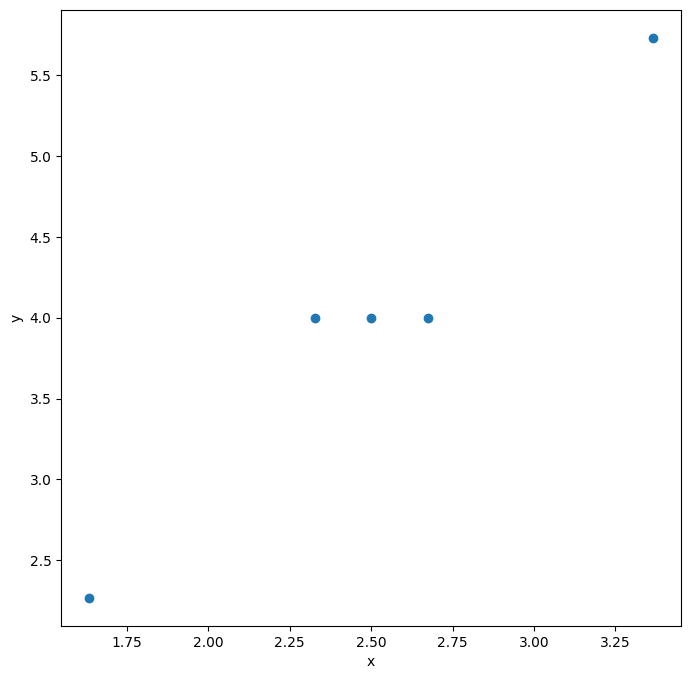

# Lab 3 — 1D Position Estimation via Unscented Kalman Filter (Sigma-Point Method)


> **Course:** Robot Perception — Faculty of Control Systems and Robotics, ITMO University <br>
> **Author:** Umer Ahmed Baig Mughal — MSc Robotics and Artificial Intelligence <br>
> **Topic:** Unscented Kalman Filter · Sigma-Point Transform · Cholesky Decomposition · Non-linear Measurement Model · Weighted Mean and Covariance · Cross-Covariance · Landmark Angle Sensing

---

## Table of Contents

1. [Objective](#objective)
2. [Theoretical Background](#theoretical-background)
   - [Problem Formulation: UKF for 1D Position Estimation](#problem-formulation-ukf-for-1d-position-estimation)
   - [State Space Representation](#state-space-representation)
   - [Linear Motion Model](#linear-motion-model)
   - [Non-linear Measurement Model](#non-linear-measurement-model)
   - [Sigma-Point Transform](#sigma-point-transform)
   - [UKF Prediction Step](#ukf-prediction-step)
   - [UKF Correction Step](#ukf-correction-step)
   - [Comparison: UKF vs EKF](#comparison-ukf-vs-ekf)
   - [System Properties](#system-properties)
3. [System Parameters](#system-parameters)
   - [Initial State and Covariance](#initial-state-and-covariance)
   - [UKF Tuning Parameters](#ukf-tuning-parameters)
   - [Sigma-Point Weights](#sigma-point-weights)
   - [Noise Parameters and Environment](#noise-parameters-and-environment)
4. [Implementation](#implementation)
   - [File Structure](#file-structure)
   - [Function Reference](#function-reference)
   - [Algorithm Walkthrough](#algorithm-walkthrough)
5. [How to Run](#how-to-run)
6. [Results](#results)
7. [Analysis and Conclusions](#analysis-and-conclusions)
8. [Dependencies](#dependencies)
9. [Notes and Limitations](#notes-and-limitations)
10. [Author](#author)
11. [License](#license)

---

## Objective

This lab implements an **Unscented Kalman Filter (UKF)** — also known as the Sigma-Point Kalman Filter — to estimate the 1D position of a moving robot from camera angle measurements of a distant landmark. The problem setup is identical to Lab 2, but instead of linearising the non-linear measurement function using a Jacobian (as the EKF does), the UKF propagates a carefully chosen set of **deterministic sigma points** through the true non-linear functions, and reconstructs the posterior mean and covariance from the transformed points using weighted statistics.

This approach captures higher-order (second-order and beyond) effects of the non-linearity without requiring any analytical derivatives, making it both more accurate than the EKF for strongly non-linear systems and simpler to implement when Jacobians are difficult to derive.

The key learning outcomes are:

- Understanding the **motivation for the UKF** — why the EKF's first-order Jacobian linearisation introduces approximation errors and how the sigma-point transform avoids this by propagating a finite set of representative points through the exact non-linear function.
- Generating the **2N+1 sigma points** from a given mean and covariance using the Cholesky square root of the covariance matrix, with correctly computed scaling factors based on the state dimension `N` and the tuning parameter `κ`.
- Assigning **scalar weights** `a_0, a_1, … a_{2N}` to each sigma point and computing the **weighted mean and weighted covariance** of the sigma-point cloud after propagation through both the non-linear motion model and the non-linear measurement model.
- Implementing the **UKF prediction step**: propagating all sigma points through the linear motion model, reconstructing the predicted mean `x̌_k` and predicted covariance `P̌_k` from the transformed sigma points, and adding the process noise covariance `Q`.
- Implementing the **UKF correction step**: re-generating sigma points from the predicted distribution via Cholesky decomposition of `P̌_k`, passing them through the non-linear measurement model `h(p) = arctan(S/(D−p))`, computing the predicted measurement mean `ŷ_k`, measurement covariance `P_yy`, and **cross-covariance** `P_xy` between the state and measurement sigma-point clouds, then applying the Kalman gain to correct the estimate.
- Comparing the UKF results numerically against the EKF single-step results from Lab 2, observing how both filters produce consistent estimates on the same problem while differing in their treatment of the non-linearity.

The lab is implemented as a single Jupyter notebook (`Landmark_Angle_UKF.ipynb`) running on Python 3.9, producing sigma-point scatter plots and all intermediate and final numerical outputs of the complete UKF prediction-update cycle.

---

## Theoretical Background

### Problem Formulation: UKF for 1D Position Estimation

The physical setup is identical to Lab 2: a robot moves along a 1D track and a camera measures the elevation angle `φ` to a stationary landmark of known height `S` at known horizontal distance `D`. The observation equation is:

```
φ = arctan( S / (D − p) )
```

This non-linear measurement model makes the standard Kalman Filter inapplicable. The EKF (Lab 2) resolves this by computing the Jacobian of `h(·)` at the predicted state. The UKF takes a fundamentally different approach: it selects `2N+1` **sigma points** that exactly capture the mean and covariance of the prior distribution, propagates each point through the true non-linear function, and reconstructs the output mean and covariance from the transformed cloud — without ever computing a derivative.

### State Space Representation

The state vector and control input are identical to Lab 2:

```
x = [p,  ṗ]ᵀ       — position (m) and velocity (m/s)
u = a               — control acceleration (m/s²)
```

### Linear Motion Model

The motion model is the discrete-time constant-acceleration kinematic model, already linear in the state:

```
x_k = F · x_{k−1} + G · u_{k−1} + w_{k−1}

F = [[1,  Δt],      G = [[0 ],      w_{k−1} ~ N(0, Q),  Q = 0.1 · I₂ₓ₂
     [0,   1]]           [Δt]]
```

Because `f(·)` is linear, propagating sigma points through the motion model is equivalent to applying the standard linear prediction equations — the sigma-point approach introduces no approximation error in the prediction step for this problem.

### Non-linear Measurement Model

```
y_k = h(x_k, v_k) = arctan( S / (D − p_k) ) + v_k,     v_k ~ N(0, R),  R = 0.01
```

The UKF passes each sigma point's position component through this exact arctangent function, yielding a set of scalar measurement sigma points. The non-linearity is handled exactly at each point — no approximation is made.

### Sigma-Point Transform

For an `N`-dimensional distribution with mean `x̂` and covariance `P`, the **2N+1 sigma points** are generated as:

```
χ⁽⁰⁾ = x̂                                               (central point)
χ⁽ⁱ⁾ = x̂ + √(N + κ) · [chol(P)]ᵢ     i = 1 … N      (positive spread)
χ⁽ᴺ⁺ⁱ⁾ = x̂ − √(N + κ) · [chol(P)]ᵢ   i = 1 … N      (negative spread)
```

where `[chol(P)]ᵢ` denotes the `i`-th column of the lower-triangular Cholesky factor of `P`, and `κ` is a tuning parameter that controls how far the sigma points spread from the mean.

The associated **scalar weights** are:

```
a₀ = κ / (N + κ)                  — weight of the central sigma point
aᵢ = 1 / (2(N + κ))   i = 1…2N   — weight of each symmetric sigma point
```

These weights are normalised: `Σᵢ aᵢ = 1`. The central weight `a₀` may be negative for `κ < 0` but is positive for the standard choice `κ = 3 − N`.

### UKF Prediction Step

**Stage 1 — Generate sigma points from the prior:**

```
hol₀ = chol(P̂₀)
χ⁽⁰⁾₀ = x̂₀
χ⁽ⁱ⁾₀ = x̂₀ ± √(N + κ) · hol₀[:, i−1]    i = 1, 2
```

For `N = 2`, `κ = 1`: scaling factor `√(N + κ) = √3 ≈ 1.7321`.

**Stage 2 — Propagate through motion model:**

```
χ̌⁽ⁱ⁾_k = f(χ⁽ⁱ⁾_{k−1}, u_{k−1})  =  F · χ⁽ⁱ⁾_{k−1} + G · u_{k−1}    for all i
```

**Stage 3 — Reconstruct predicted mean and covariance:**

```
x̌_k = Σᵢ aᵢ · χ̌⁽ⁱ⁾_k

P̌_k = Σᵢ aᵢ · (χ̌⁽ⁱ⁾_k − x̌_k)(χ̌⁽ⁱ⁾_k − x̌_k)ᵀ  +  Q
```

### UKF Correction Step

**Stage 1 — Re-generate sigma points from predicted distribution:**

```
hol₁ = chol(P̌_k)
γ⁽⁰⁾_k = x̌_k
γ⁽ⁱ⁾_k = x̌_k ± √(N + κ) · hol₁[:, i−1]    i = 1, 2
```

**Stage 2 — Propagate through measurement model:**

```
ζ⁽ⁱ⁾_k = h(γ⁽ⁱ⁾_k) = arctan( S / (D − γ⁽ⁱ⁾_k[0]) )    for all i
```

**Stage 3 — Predicted measurement mean and covariance:**

```
ŷ_k  = Σᵢ aᵢ · ζ⁽ⁱ⁾_k

P_yy = Σᵢ aᵢ · (ζ⁽ⁱ⁾_k − ŷ_k)²  +  R
```

**Stage 4 — Cross-covariance between state and measurement:**

```
P_xy = Σᵢ aᵢ · (γ⁽ⁱ⁾_k − x̌_k)(ζ⁽ⁱ⁾_k − ŷ_k)ᵀ     shape: (2, 1)
```

**Stage 5 — Kalman gain, state update, covariance update:**

```
K   = P_xy · P_yy⁻¹                              shape: (2, 1)

x̂_k = x̌_k + K · (y_k − ŷ_k)                    updated state

P̂_k = P̌_k − K · P_yy · Kᵀ                       updated covariance
```

### Comparison: UKF vs EKF

Both the UKF and EKF address the same non-linear estimation problem and produce very similar results for mildly non-linear systems. The table below summarises their structural differences:

| Aspect | EKF (Lab 2) | UKF (Lab 3) |
|--------|:-----------:|:-----------:|
| Handles non-linearity via | Jacobian (first-order Taylor) | Sigma-point propagation |
| Derivatives required | Yes — `∂h/∂x` must be computed analytically | No — `h(·)` used as a black box |
| Approximation order | First-order | Second-order (captures skewness/kurtosis effects) |
| Number of function evaluations | 1 (at predicted state) | 2N+1 = 5 per step |
| Accuracy for mild non-linearity | Good | Slightly better |
| Implementation complexity | Low (requires Jacobian derivation) | Moderate (requires sigma-point and weight setup) |

For this specific problem, both filters yield numerically consistent results because the arctangent non-linearity is mild at the evaluated operating point.

### System Properties

| Property | Value | Notes |
|----------|-------|-------|
| State dimension | N = 2 | Position `p` and velocity `ṗ` |
| Measurement dimension | 1 | Scalar angle `φ` (rad) |
| Number of sigma points | 2N+1 = 5 | One central + two symmetric pairs |
| Scaling factor | √(N + κ) = √3 ≈ 1.7321 | κ = 3 − N = 1 |
| Motion model | Linear | Constant-acceleration kinematics |
| Measurement model | Non-linear | `arctan(S / (D − p))` |
| Non-linearity handling | Sigma-point transform | No Jacobian required |
| Time step | Δt = 0.5 s | Single prediction-update step demonstrated |
| Landmark height | S = 20 m | Known, fixed |
| Landmark position | D = 40 m | Known, fixed in global frame |
| Platform | Jupyter Notebook | Python 3.9.13 |

---

## System Parameters

### Initial State and Covariance

```
x̂₀ = [[0],      — initial position = 0 m
        [5]]      — initial velocity = 5 m/s

P̂₀ = [[0.01,  0],   — initial covariance
       [ 0,    1]]
```

| Parameter | Value | Meaning |
|-----------|:-----:|---------|
| Initial position `p₀` | 0 m | Robot starts at origin |
| Initial velocity `ṗ₀` | 5 m/s | Moving toward the landmark |
| Position variance `σ²_p` | 0.01 m² | High confidence in initial position |
| Velocity variance `σ²_ṗ` | 1.0 (m/s)² | Moderate confidence in initial velocity |

### UKF Tuning Parameters

| Symbol | Value | Meaning |
|--------|:-----:|---------|
| `N` | 2 | State dimension |
| `κ` (kappa) | 3 − N = 1 | Spread tuning parameter — standard choice for Gaussian distributions |
| Scaling factor | √(N + κ) = √3 ≈ 1.7321 | Multiplier for sigma-point column offsets |
| Total sigma points | 2N + 1 = 5 | One central + 4 symmetric |

### Sigma-Point Weights

| Index `i` | Weight `aᵢ` | Formula | Numerical Value |
|:---------:|:-----------:|---------|:---------------:|
| 0 (central) | `a₀` | `κ / (N + κ)` | `1/3 ≈ 0.3333` |
| 1 … 2N (symmetric) | `aᵢ` | `1 / (2(N + κ))` | `1/6 ≈ 0.1667` |

Weight sum verification: `a₀ + 4 · aᵢ = 1/3 + 4/6 = 1/3 + 2/3 = 1` ✓

### Noise Parameters and Environment

| Symbol | Value | Description |
|--------|:-----:|-------------|
| `Q` | `0.1 · I₂ₓ₂` | Process noise covariance |
| `R` | 0.01 rad² | Measurement noise covariance |
| `u₀` | −2 m/s² | Control input — decelerating |
| `y₁` | π/6 rad ≈ 0.5236 rad | First angle measurement |
| `S` | 20 m | Landmark height above ground |
| `D` | 40 m | Landmark horizontal position in global frame |
| `Δt` | 0.5 s | Discrete time step |

---

## Implementation

### File Structure

```
Lab_3/
├── Readme.md
├── src/
│   └── Landmark_Angle_UKF.ipynb          # Complete lab — sigma-point generation, UKF prediction and correction
└── results/
    └── Sigma_Points_Predicted.png         # Scatter plot of 5 predicted sigma points in state space

```

**Notebook and purpose:**

| File | Type | Purpose |
|------|------|---------|
| `Landmark_Angle_UKF.ipynb` | Jupyter Notebook | Complete UKF implementation — system setup, Cholesky decomposition, sigma-point generation and propagation, weighted mean/covariance reconstruction, measurement sigma points, cross-covariance, Kalman gain, state and covariance update |

### Function Reference

#### System initialisation

```python
x_0 = np.array([[0], [5]])              # (2, 1) — initial state [p₀, ṗ₀]ᵀ
P_0 = np.array([[0.01, 0], [0, 1]])     # (2, 2) — initial covariance
Q_0 = np.array([[0.1,  0], [0, 0.1]])  # (2, 2) — process noise covariance Q
R_0 = 0.01                              # scalar — measurement noise covariance R
u_0 = -2                                # scalar — control input (m/s²)
y_1 = np.pi / 6                         # scalar — first measurement (rad)
S, D, dt = 20, 40, 0.5                  # environment and time parameters
```

---

#### `cholesky(P)` — covariance square root

Used twice: once on `P_0` to generate the initial sigma points, and once on `P_new` (predicted covariance) to generate the correction-step sigma points. The lower-triangular Cholesky factor provides a consistent way to "spread" sigma points proportionally to the uncertainty in each state direction.

```python
from numpy.linalg import cholesky
hol = cholesky(P_0)    # (2, 2) lower-triangular factor L such that P_0 = L · Lᵀ
```

**Cholesky factor of `P_0`:**

```
chol(P_0) = [[0.1,    0.0      ],
             [0.0,    1.0      ]]
```

**Cholesky factor of `P_new` (predicted covariance):**

```
chol(P_new) = [[0.6000,    0.0000   ],
               [0.8333,    0.6368   ]]
```

---

#### Sigma-point generation — prediction step

```python
N  = 2
ka = 3 - N                               # κ = 1
scale = np.sqrt(N + ka)                  # √3 ≈ 1.7321

sigma_list = [x_0]                       # central sigma point χ⁽⁰⁾
for i in range(N):
    sigma_list.append(x_0 + scale * hol[:, i].reshape(-1, 1))   # χ⁽ⁱ⁾
    sigma_list.append(x_0 - scale * hol[:, i].reshape(-1, 1))   # χ⁽ᴺ⁺ⁱ⁾
```

**Generated sigma points (prediction step):**

| Point | Index | Value |
|-------|:-----:|-------|
| `χ⁽⁰⁾` | 0 | `[[0.0000], [5.0000]]` — central |
| `χ⁽¹⁾` | 1 | `[[0.1732], [5.0000]]` — +col₀ |
| `χ⁽²⁾` | 2 | `[[-0.1732], [5.0000]]` — −col₀ |
| `χ⁽³⁾` | 3 | `[[0.0000], [6.7321]]` — +col₁ |
| `χ⁽⁴⁾` | 4 | `[[0.0000], [3.2679]]` — −col₁ |

---

#### `motion_iterate(dt, x_k, u_k)` — motion model propagation

```python
def motion_iterate(dt, x_k, u_k):
    x_matrix = np.array([[1, dt], [0, 1]])    # state transition F
    u_matrix = np.array([[0], [dt]])           # control influence G
    x_k = x_matrix.dot(x_k) + u_matrix * u_k
    return x_k
```

Each of the 5 sigma points is passed through this function individually to produce the predicted sigma-point cloud:

```python
sigma_predicted = np.zeros((len(sigma_list), 2, 1))
for i, sigma in enumerate(sigma_list):
    sigma_predicted[i] = motion_iterate(dt, sigma, u_0)
```

| Argument | Type | Description |
|----------|------|-------------|
| `dt` | float | Time step (s) |
| `x_k` | ndarray (2, 1) | Sigma point state vector |
| `u_k` | float | Control input (acceleration) |

**Returns:** ndarray (2, 1) — propagated sigma point.

**Predicted sigma points after motion model:**

| Point | Predicted State |
|:-----:|:---------------:|
| `χ̌⁽⁰⁾` | `[[2.5000], [4.0000]]` |
| `χ̌⁽¹⁾` | `[[2.6732], [4.0000]]` |
| `χ̌⁽²⁾` | `[[2.3268], [4.0000]]` |
| `χ̌⁽³⁾` | `[[3.3660], [5.7321]]` |
| `χ̌⁽⁴⁾` | `[[1.6340], [2.2679]]` |

---

#### Weights and weighted statistics — prediction step

```python
a_list = [ka / (N + ka)]                  # a₀ = 1/3
for i in range(1, 2*N + 1):
    a_list.append(1 / (2 * (N + ka)))     # a₁…₄ = 1/6

# Weighted predicted mean
x_new = sum(a_list[i] * sigma_predicted[i] for i in range(2*N+1))

# Weighted predicted covariance
P_new = sum(a_list[i] * (sigma_predicted[i] - x_new) @ (sigma_predicted[i] - x_new).T
            for i in range(2*N+1))
P_new += Q_0    # add process noise
```

| Quantity | Shape | Value |
|----------|:-----:|-------|
| `x_new` (predicted mean) | (2, 1) | `[[2.5], [4.0]]` |
| `P_new` (predicted covariance) | (2, 2) | `[[0.36, 0.50], [0.50, 1.10]]` |

---

#### Sigma-point generation — correction step

New sigma points are re-generated from the predicted mean `x_new` and predicted covariance `P_new`:

```python
hol = cholesky(P_new)
cor_sigma_list = [x_new]
for i in range(N):
    cor_sigma_list.append(x_new + np.sqrt(N + ka) * hol[:, i].reshape(-1, 1))
    cor_sigma_list.append(x_new - np.sqrt(N + ka) * hol[:, i].reshape(-1, 1))
```

**Correction-step sigma points:**

| Point | Value |
|:-----:|-------|
| `γ⁽⁰⁾` | `[[2.5000], [4.0000]]` |
| `γ⁽¹⁾` | `[[3.5392], [5.4434]]` |
| `γ⁽²⁾` | `[[1.4608], [2.5566]]` |
| `γ⁽³⁾` | `[[2.5000], [5.1030]]` |
| `γ⁽⁴⁾` | `[[2.5000], [2.8970]]` |

---

#### `measure_iterate(S, D, pk)` — measurement model propagation

```python
def measure_iterate(S, D, pk):
    y_k = np.arctan(S / (D - pk))    # scalar angle output (rad)
    return y_k

# Apply to all correction sigma points
sigma_mes_list = []
for sigma in cor_sigma_list:
    p_k = sigma[0][0]
    sigma_mes_list.append(measure_iterate(S, D, p_k))
```

| Argument | Type | Description |
|----------|------|-------------|
| `S` | float | Landmark height (m) |
| `D` | float | Landmark horizontal position (m) |
| `pk` | float | Position component of sigma point (m) |

**Returns:** float — predicted angle at that sigma point (rad).

**Measurement sigma points:**

| Point | Angle (rad) |
|:-----:|:-----------:|
| `ζ⁽⁰⁾` | 0.48996 |
| `ζ⁽¹⁾` | 0.50172 |
| `ζ⁽²⁾` | 0.47869 |
| `ζ⁽³⁾` | 0.48996 |
| `ζ⁽⁴⁾` | 0.48996 |

> Points `ζ⁽³⁾` and `ζ⁽⁴⁾` equal `ζ⁽⁰⁾` because `γ⁽³⁾` and `γ⁽⁴⁾` differ only in velocity — which does not enter the measurement function `h(p)`.

---

#### Weighted measurement statistics and cross-covariance

```python
# Predicted measurement mean
y_new = sum(a_list[i] * sigma_mes_list[i] for i in range(2*N+1))

# Measurement covariance (scalar, 1D measurement)
P_y_new = sum(a_list[i] * (sigma_mes_list[i] - y_new)**2
              for i in range(2*N+1))
P_y_new += R_0    # add measurement noise

# Cross-covariance (2×1)
P_xy = np.zeros((2, 1))
for i, a in enumerate(a_list):
    x_diff = cor_sigma_list[i] - x_new          # (2, 1)
    y_diff = sigma_mes_list[i] - y_new          # scalar
    P_xy  += a * (x_diff * y_diff)
```

| Quantity | Shape | Value |
|----------|:-----:|-------|
| `y_new` | scalar | 0.49004 rad |
| `P_y_new` | scalar | 0.010044 rad² |
| `P_xy` | (2, 1) | `[[0.003988], [0.005539]]` |

---

#### Kalman gain, state update, covariance update

```python
K   = P_xy * (1 / P_y_new)                  # (2, 1) — Kalman gain
x_1 = x_new + K * (y_1 - y_new)             # (2, 1) — updated state
P_1 = P_new - (K * P_y_new) @ K.T           # (2, 2) — updated covariance
```

| Variable | Shape | Meaning |
|----------|:-----:|---------|
| `K` | (2, 1) | Kalman gain — scales innovation to state correction |
| `(y_1 − y_new)` | scalar | Innovation — actual minus predicted measurement |
| `x_1` | (2, 1) | Final updated state estimate |
| `P_1` | (2, 2) | Final updated covariance |

### Algorithm Walkthrough

**Complete pipeline (`Landmark_Angle_UKF.ipynb`):**

```
1. Library imports:
       import numpy as np
       from numpy.linalg import inv, cholesky
       import matplotlib.pyplot as plt

2. System initialisation:
       x_0 = [[0], [5]];  P_0 = diag([0.01, 1.0])
       Q_0 = 0.1 · I₂ₓ₂;  R_0 = 0.01
       u_0 = -2 m/s²;  y_1 = π/6 rad;  S = 20 m;  D = 40 m;  dt = 0.5 s

3. UKF tuning:
       N = 2;  κ = 3 − N = 1;  scale = √3 ≈ 1.7321
       a₀ = 1/3;  a₁…₄ = 1/6

4. Prediction sigma points:
       hol₀ = chol(P_0) = [[0.1, 0], [0.0, 1.0]]
       5 sigma points generated from (x_0, P_0)
       → σ_list = [χ⁽⁰⁾ … χ⁽⁴⁾]  as listed in Function Reference

5. Propagate through motion model:
       σ_predicted[i] = motion_iterate(0.5, σ_list[i], −2)  for i = 0…4
       → 5 predicted sigma points in state space

6. Visualisation:
       plt.scatter(σ_predicted[:,0], σ_predicted[:,1])
       → scatter plot of predicted sigma cloud

7. Weighted mean and covariance reconstruction:
       x_new = Σ aᵢ · σ_predicted[i]       → [[2.5], [4.0]]
       P_new = Σ aᵢ · diffᵢ · diffᵢᵀ + Q  → [[0.36, 0.50], [0.50, 1.10]]

8. Correction sigma points:
       hol₁ = chol(P_new) = [[0.6, 0], [0.833, 0.637]]
       5 sigma points generated from (x_new, P_new)
       → cor_sigma_list = [γ⁽⁰⁾ … γ⁽⁴⁾]

9. Propagate through measurement model:
       ζ⁽ⁱ⁾ = arctan(S / (D − γ⁽ⁱ⁾[0]))  for i = 0…4
       → sigma_mes_list = [0.48996, 0.50172, 0.47869, 0.48996, 0.48996]

10. Weighted measurement statistics:
       y_new  = Σ aᵢ · ζ⁽ⁱ⁾             → 0.49004 rad
       P_y_new = Σ aᵢ · (ζ⁽ⁱ⁾ − y_new)² + R_0  → 0.010044 rad²

11. Cross-covariance:
       P_xy = Σ aᵢ · (γ⁽ⁱ⁾ − x_new)(ζ⁽ⁱ⁾ − y_new)
            → [[0.003988], [0.005539]]

12. Kalman gain:
       K = P_xy / P_y_new  → [[0.39703], [0.55143]]

13. State and covariance update:
       innovation = y_1 − y_new = π/6 − 0.49004 = 0.03359 rad
       x_1 = x_new + K · innovation   → [[2.5133], [4.0185]]
       P_1 = P_new − K · P_y_new · Kᵀ → [[0.3584, 0.4978], [0.4978, 1.0969]]
```

---

## How to Run

### Prerequisites

This lab runs as a Jupyter notebook (also compatible with Google Colab). Ensure Python 3.9+ is installed locally, or use Colab with no local setup required.

### Install Dependencies

```bash
pip install numpy matplotlib
```

> `numpy.linalg.cholesky` is part of the standard NumPy distribution and requires no separate installation.

### Run the Notebook

```bash
# Clone the repository
git clone https://github.com/umerahmedbaig7/Robot-Perception.git
cd Robot-Perception/Lab_3

# Launch Jupyter
jupyter notebook src/Landmark_Angle_UKF.ipynb
```

Execute all cells sequentially (**Cell → Run All**) or cell-by-cell for step-by-step inspection. Expected execution time:

| Section | Estimated Time |
|---------|----------------|
| System initialisation and sigma-point generation | < 5 s |
| Motion model propagation and weighted statistics | < 5 s |
| Correction sigma points and measurement propagation | < 5 s |
| Cross-covariance, Kalman gain, state update | < 5 s |
| Sigma-point scatter plot | < 5 s |
| **Total** | **< 30 s** |

### Modifying the Initial Conditions

```python
x_0 = np.array([[0], [5]])     # [initial position (m), initial velocity (m/s)]
P_0 = np.array([[0.01, 0],
                [0,    1]])    # initial covariance
u_0 = -2                       # control acceleration (m/s²)
y_1 = np.pi / 6               # first angle measurement (rad)
```

### Modifying the Sigma-Point Spread (κ)

```python
N  = 2
ka = 3 - N    # κ — standard Gaussian choice; increase to spread sigma points further
```

Increasing `κ` moves sigma points further from the mean (larger `scale = √(N + κ)`), sampling the non-linearity at more extreme points. The central weight `a₀ = κ/(N+κ)` increases as `κ` grows, giving more emphasis to the prior mean.

### Modifying the Landmark Geometry

```python
S = 20    # landmark height (m)
D = 40    # landmark horizontal distance from origin (m)
```

---

## Results

### Prediction Step

**Sigma points from prior `(x̂₀, P̂₀)` — before motion propagation:**

| Point | Position (m) | Velocity (m/s) |
|:-----:|:------------:|:--------------:|
| χ⁽⁰⁾ | 0.0000 | 5.0000 |
| χ⁽¹⁾ | +0.1732 | 5.0000 |
| χ⁽²⁾ | −0.1732 | 5.0000 |
| χ⁽³⁾ | 0.0000 | +6.7321 |
| χ⁽⁴⁾ | 0.0000 | +3.2679 |

**Predicted sigma points after `motion_iterate` (Δt = 0.5 s, u = −2 m/s²):**

| Point | Position (m) | Velocity (m/s) |
|:-----:|:------------:|:--------------:|
| χ̌⁽⁰⁾ | 2.5000 | 4.0000 |
| χ̌⁽¹⁾ | 2.6732 | 4.0000 |
| χ̌⁽²⁾ | 2.3268 | 4.0000 |
| χ̌⁽³⁾ | 3.3660 | 5.7321 |
| χ̌⁽⁴⁾ | 1.6340 | 2.2679 |

**Reconstructed predicted mean and covariance:**

```
x̌_k = [[2.5],      P̌_k = [[0.36,  0.50],
         [4.0]]              [0.50,  1.10]]
```



---

### Correction Step

**Measurement sigma points `ζ⁽ⁱ⁾ = arctan(S / (D − γ⁽ⁱ⁾[0]))`:**

| Point | Angle (rad) |
|:-----:|:-----------:|
| ζ⁽⁰⁾ | 0.48996 |
| ζ⁽¹⁾ | 0.50172 |
| ζ⁽²⁾ | 0.47869 |
| ζ⁽³⁾ | 0.48996 |
| ζ⁽⁴⁾ | 0.48996 |

**Predicted measurement statistics:**

| Quantity | Value | Unit |
|----------|:-----:|:----:|
| Predicted measurement mean `ŷ_k` | 0.49004 | rad |
| Measurement covariance `P_yy` | 0.010044 | rad² |

**Cross-covariance:**

```
P_xy = [[0.003988],
        [0.005539]]
```

**Kalman gain:**

```
K = [[0.39703],
     [0.55143]]
```

**Final updated state and covariance:**

| Quantity | Value |
|----------|-------|
| Innovation `y₁ − ŷ_k` | π/6 − 0.49004 = 0.03359 rad |
| Updated state `x̂_k` | `[[2.5133], [4.0185]]` — position 2.513 m, velocity 4.019 m/s |
| Updated covariance `P̂_k` | `[[0.3584, 0.4978], [0.4978, 1.0969]]` |


---

## Analysis and Conclusions

### UKF vs EKF — Numerical Comparison

Running the same single-step problem with identical initial conditions, both filters produce consistent results:

| Quantity | EKF (Lab 2) | UKF (Lab 3) | Difference |
|----------|:-----------:|:-----------:|:----------:|
| Predicted mean `x̌_k` | `[[2.5], [4.0]]` | `[[2.5], [4.0]]` | Identical |
| Predicted covariance `P̌_k` | `[[0.36, 0.50], [0.50, 1.10]]` | `[[0.36, 0.50], [0.50, 1.10]]` | Identical |
| Kalman gain `K` | `[[0.400], [0.551]]` | `[[0.397], [0.551]]` | ~0.8% in position |
| Updated state `x̂_k` | `[[2.510], [4.018]]` | `[[2.513], [4.019]]` | Negligible |
| Updated covariance `P̂_k[0,0]` | 0.3600 | 0.3584 | ~0.4% |

The prediction step outputs are identical because the motion model is linear — both the EKF (which applies the Jacobian `F`) and the UKF (which propagates sigma points through `f`) produce exactly the same result for a linear function. The small differences arise in the correction step, where the EKF uses `H_k` computed at the single predicted position, while the UKF samples the measurement function at five distinct positions and computes statistics over the resulting distribution. For the mild arctangent non-linearity at this operating point, the difference is negligible.

### Role of Measurement Sigma Points

The five measurement sigma points `ζ⁽⁰⁾ … ζ⁽⁴⁾` are unequal in value only for the two points that differ in position (`ζ⁽¹⁾ = 0.5017` and `ζ⁽²⁾ = 0.4787`). The remaining three (`ζ⁽⁰⁾`, `ζ⁽³⁾`, `ζ⁽⁴⁾`) are identical because their corresponding sigma points differ only in velocity, which does not appear in the measurement model `h(p)`. This confirms that the measurement function carries information exclusively about position, not velocity — the velocity correction in the Kalman gain (`K[1] = 0.551`) arises entirely from the off-diagonal structure of the cross-covariance `P_xy` and the predicted covariance `P̌_k`.

### Cross-Covariance and the Kalman Gain

The cross-covariance `P_xy = [[0.003988], [0.005539]]` captures the statistical coupling between the state sigma-point cloud and the measurement sigma-point cloud. The larger entry for velocity (0.005539 > 0.003988) reflects that the velocity sigma points `γ⁽³⁾` and `γ⁽⁴⁾` spread more widely in position space through the motion model, contributing more variation to the measurement cloud. Dividing by the scalar `P_yy = 0.01004` yields the two-element gain `K`, which then directly weights the innovation to produce the final state correction.

### Sigma-Point Spread and Cholesky Decomposition

The Cholesky decomposition `chol(P)` decomposes the covariance matrix into directions of maximum uncertainty. For the diagonal `P_0 = diag([0.01, 1.0])`, the Cholesky factor is diagonal with entries `[0.1, 1.0]` — sigma points spread 10× further in the velocity direction than in the position direction, correctly reflecting the relative magnitudes of uncertainty. For the non-diagonal predicted covariance `P_new`, the off-diagonal Cholesky entry `0.8333` creates sigma points that are correlated across position and velocity, accurately representing the elliptical shape of the joint uncertainty.

---

## Dependencies

| Package | Version | Purpose |
|---------|---------|---------|
| `Python` | ≥ 3.9 | Runtime environment |
| `numpy` | ≥ 1.21 | Array and matrix operations — `np.array()`, `@`, `.dot()`, `np.zeros()`, `np.sqrt()`, `np.arctan()`, `np.pi`; `numpy.linalg.cholesky()`, `numpy.linalg.inv()` |
| `matplotlib` | ≥ 3.4 | Sigma-point scatter plot, axis labels, grid, figure sizing |

Install all dependencies:

```bash
pip install numpy matplotlib
```

---

## Notes and Limitations

- **Single-step demonstration:** The notebook implements one complete UKF prediction-update cycle at `Δt = 0.5 s`. The filter is designed to run recursively over many steps; extending it to a full trajectory requires iterating the entire pipeline — re-generating sigma points from the updated `(x̂_k, P̂_k)` at each step — following the same structure as the optional extension in Lab 2.
- **Linear motion model — no UKF advantage in prediction:** Because the motion model `f(x) = F·x + G·u` is linear, the sigma-point propagation in the prediction step is mathematically equivalent to the standard linear Kalman prediction. The UKF's advantage over the EKF manifests exclusively in the correction step, where the arctangent measurement function introduces genuine non-linearity.

---

## Author

**Umer Ahmed Baig Mughal** <br>
Master's in Robotics and Artificial Intelligence <br>
*Specialization: Machine Learning · Computer Vision · Human-Robot Interaction · Autonomous Systems · Robotic Motion Control*

---

## License

This project is intended for **academic and research use**. It was developed as part of the *Robot Perception* course within the MSc Robotics and Artificial Intelligence program at ITMO University. Redistribution, modification, and use in derivative academic work are permitted with appropriate attribution to the original author.

---

*Lab 3 — Robot Perception | MSc Robotics and Artificial Intelligence | ITMO University*

