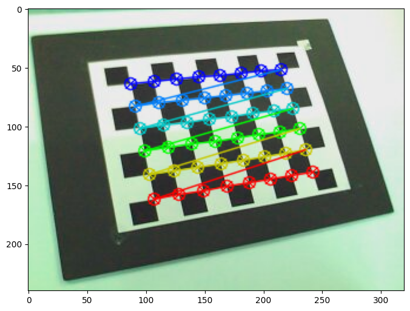
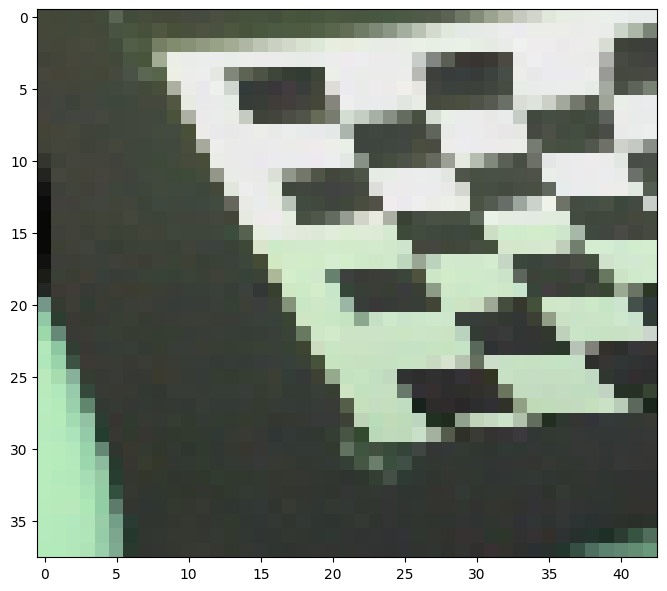
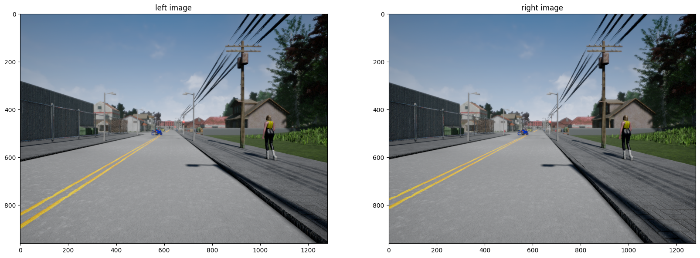
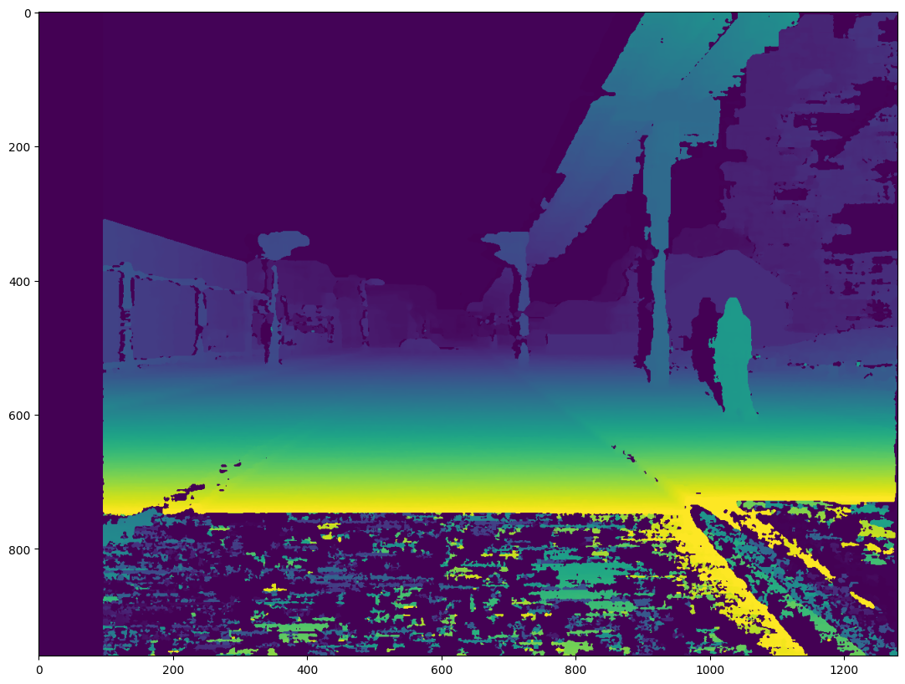
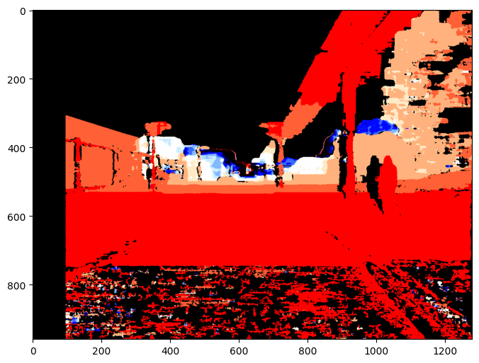
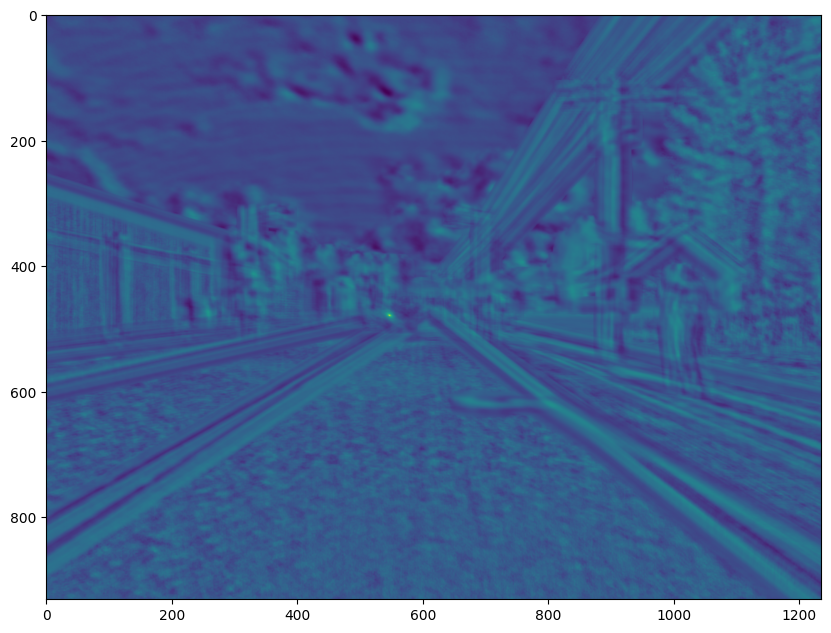
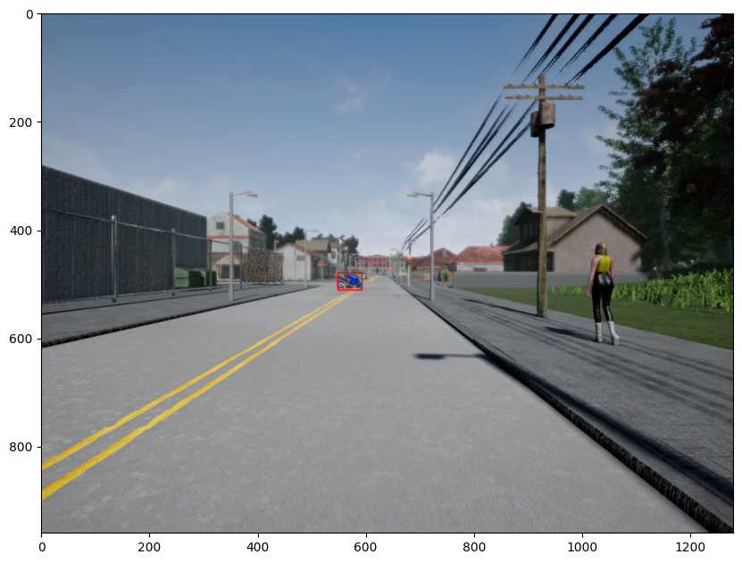

# Lab 4 — Camera Calibration and Stereo Depth Estimation


> **Course:** Robot Perception — Faculty of Control Systems and Robotics, ITMO University <br>
> **Author:** Umer Ahmed Baig Mughal — MSc Robotics and Artificial Intelligence <br>
> **Topic:** Camera Calibration · Checkerboard Corner Detection · Intrinsic Parameters · Distortion Coefficients · Stereo Vision · Disparity Map · StereoSGBM · Projection Matrix Decomposition · Depth Map · Obstacle Detection · Distance to Collision

---

## Table of Contents

1. [Objective](#objective)
2. [Theoretical Background](#theoretical-background)
   - [Part 1: Camera Calibration](#part-1-camera-calibration)
   - [Pinhole Camera Model and Intrinsic Parameters](#pinhole-camera-model-and-intrinsic-parameters)
   - [Lens Distortion Model](#lens-distortion-model)
   - [Part 2: Stereo Depth Estimation](#part-2-stereo-depth-estimation)
   - [Projection Matrix and Decomposition](#projection-matrix-and-decomposition)
   - [Disparity and the Stereo Depth Equation](#disparity-and-the-stereo-depth-equation)
   - [Template Matching for Obstacle Detection](#template-matching-for-obstacle-detection)
   - [System Properties](#system-properties)
3. [System Parameters](#system-parameters)
   - [Calibration Setup](#calibration-setup)
   - [Stereo Camera Setup](#stereo-camera-setup)
   - [StereoSGBM Parameters](#stereosgbm-parameters)
4. [Implementation](#implementation)
   - [File Structure](#file-structure)
   - [Function Reference](#function-reference)
   - [Algorithm Walkthrough](#algorithm-walkthrough)
5. [How to Run](#how-to-run)
6. [Results](#results)
7. [Analysis and Conclusions](#analysis-and-conclusions)
8. [Dependencies](#dependencies)
9. [Notes and Limitations](#notes-and-limitations)
10. [Author](#author)
11. [License](#license)

---

## Objective

This lab covers two fundamental computer vision pipelines that form the perceptual backbone of autonomous robotic systems: **monocular camera calibration** using a known checkerboard target, and **stereo depth estimation** for obstacle distance measurement.

**Part 1** calibrates a monocular camera from 19 images of an 8×6 checkerboard pattern, recovering the camera's intrinsic parameter matrix `K`, five distortion coefficients, and the extrinsic rotation/translation vectors for each image. The calibrated parameters are then used to remove lens distortion from a sample image.

**Part 2** applies stereo vision to estimate the 3D depth of a real scene captured by a calibrated stereo camera pair. A disparity map is computed using StereoSGBM, the projection matrices are decomposed to extract intrinsics and extrinsics, a full depth map is generated using the stereo depth equation `Z = f·b/d`, and a motorcycle obstacle is located in the scene using template matching — with its nearest-point depth estimated at **28.764 metres**.

The key learning outcomes are:

- Understanding the **pinhole camera model** and the role of each intrinsic parameter — focal lengths `fx`, `fy`, principal point `(cx, cy)`, and the five distortion coefficients `[k1, k2, p1, p2, k3]` — in mapping 3D world points to 2D image coordinates.
- Implementing the **Zhang checkerboard calibration pipeline**: generating 3D object points in the checkerboard frame, detecting and refining corner locations in each image using `cv2.findChessboardCorners()` and `cv2.cornerSubPix()`, and solving for all camera parameters simultaneously via `cv2.calibrateCamera()`.
- Applying the calibrated parameters to **undistort images** using `cv2.getOptimalNewCameraMatrix()`, `cv2.initUndistortRectifyMap()`, and `cv2.remap()` — and understanding the role of the optimal new camera matrix in balancing field-of-view preservation against distortion correction completeness.
- Implementing `compute_left_disparity_map()` using **StereoSGBM** — understanding its parameters (block size, number of disparities, P1/P2 smoothness penalties, uniqueness ratio, speckle filtering) and the need to divide 16-bit fixed-point output by 16 to recover true sub-pixel disparity values.
- Using `cv2.decomposeProjectionMatrix()` to extract the intrinsic matrix `K`, rotation matrix `R`, and translation vector `t` from a `3×4` projection matrix, and performing the **homogeneous divide** to convert the recovered translation from homogeneous to Euclidean coordinates.
- Computing a **depth map** from the stereo equation `Z = f·b/d`, deriving the baseline `b` as the Euclidean distance between the two camera translation vectors, and handling invalid disparity values (zero and negative) to prevent division-by-zero artefacts.
- Locating a detected obstacle in the scene using **normalised cross-correlation template matching** (`cv2.matchTemplate` with `TM_CCOEFF_NORMED`), cropping the corresponding depth map region, and reporting the **nearest-point depth** as the minimum valid depth value within the bounding box.

The lab is implemented as a single Jupyter notebook (`Camera_Calibration_Stereo_Depth.ipynb`) running on Python 3.9 with OpenCV, producing calibration parameter outputs, corner-detection visualisations for all 19 images, a disparity map, a depth map, a cross-correlation heatmap, a bounding-box overlay on the left image, and the final obstacle distance.

---

## Theoretical Background

### Part 1: Camera Calibration

Camera calibration is the process of estimating the **intrinsic parameters** that define a camera's internal optical geometry, and the **extrinsic parameters** that define its position and orientation relative to a known calibration target — a checkerboard — in each image.

The calibration procedure follows **Zhang's method** (2000): images of a planar checkerboard of known dimensions are taken from multiple viewpoints. The 3D coordinates of the checkerboard corners are known in the checkerboard's own coordinate frame, and the 2D pixel coordinates of those same corners are detected in each image. The overdetermined system of correspondences is solved via least squares to recover all camera parameters simultaneously.

### Pinhole Camera Model and Intrinsic Parameters

The pinhole camera model projects a 3D world point `[X, Y, Z]ᵀ` onto the image plane at pixel coordinate `[u, v]ᵀ` via:

```
[u]   [fx   0   cx] [X]
[v] = [ 0  fy   cy] [Y] / Z
[1]   [ 0   0    1] [Z]
         ─── K ───
```

where `K` is the **camera intrinsic matrix** (also called the calibration matrix):

```
K = [[fx,   0,  cx],
     [ 0,  fy,  cy],
     [ 0,   0,   1]]

where:
    fx, fy  — focal lengths in pixel units along x and y axes
    cx, cy  — principal point coordinates (optical centre in pixels)
```

The full projection including the extrinsic parameters is:

```
λ · [u, v, 1]ᵀ  =  K · [R | t] · [X, Y, Z, 1]ᵀ

where:
    R    — 3×3 rotation matrix (world → camera orientation)
    t    — 3×1 translation vector (world → camera position)
    λ    — scalar depth (homogeneous normalisation)
```

### Lens Distortion Model

Real lenses deviate from the ideal pinhole model, introducing **radial distortion** (barrel or pincushion) and **tangential distortion** (lens misalignment). OpenCV models this with five distortion coefficients:

```
dist = [k1, k2, p1, p2, k3]

where:
    k1, k2, k3  — radial distortion coefficients
    p1, p2      — tangential distortion coefficients
```

The undistorted normalised coordinates `(x_c, y_c)` map to distorted coordinates via:

```
r² = x_c² + y_c²

x_d = x_c (1 + k1·r² + k2·r⁴ + k3·r⁶) + 2p1·x_c·y_c + p2(r² + 2x_c²)
y_d = y_c (1 + k1·r² + k2·r⁴ + k3·r⁶) + p1(r² + 2y_c²) + 2p2·x_c·y_c
```

To recover the undistorted image, OpenCV inverts this mapping per-pixel using `initUndistortRectifyMap()` followed by `remap()`.

### Part 2: Stereo Depth Estimation

A stereo camera system consists of two cameras separated by a known **baseline** distance `b`. When both cameras observe the same scene, a 3D point that projects to pixel `x_L` in the left image and `x_R` in the right image exhibits a **horizontal disparity** `d = x_L − x_R`. This disparity is inversely proportional to depth:

```
Z = (f · b) / d

where:
    Z  — depth of the 3D point from the camera plane (m)
    f  — focal length of the camera (pixels)
    b  — baseline: distance between the two camera optical centres (m)
    d  — disparity: difference in x-pixel coordinates between left and right images
```

Points that are far away produce small disparities; nearby points produce large disparities. This is the fundamental equation of passive stereo vision.

### Projection Matrix and Decomposition

Each camera in a stereo pair is described by a `3×4` **projection matrix** `P`:

```
P = K · [R | t]     (3×4)
```

Decomposing `P` recovers:
- `K` — 3×3 intrinsic matrix
- `R` — 3×3 rotation matrix
- `t` — 3×1 translation vector (in homogeneous form from `cv2.decomposeProjectionMatrix`, requiring a **perspective divide** by `t[3]` to recover the 3D Euclidean translation)

The baseline is then computed as:

```
b = ‖t_left − t_right‖₂
```

### Disparity and the Stereo Depth Equation

The **StereoSGBM** (Semi-Global Block Matching) algorithm computes a dense disparity map by finding, for each pixel in the left image, the best-matching pixel position in the right image. SGBM minimises a global energy function that penalises both matching cost and disparity discontinuities, producing smoother and more complete disparity maps than the basic StereoBM algorithm. Its key parameters are:

```
minDisparity     — smallest disparity to search (pixels)
numDisparities   — disparity search range (must be divisible by 16)
blockSize        — matched block size (odd number, pixels)
P1               — smoothness penalty for single-pixel disparity change = 8 · channels · blockSize²
P2               — smoothness penalty for larger disparity jumps   = 32 · channels · blockSize²
disp12MaxDiff    — max allowed difference in left-right disparity check
uniquenessRatio  — margin by which the best match must beat the second-best (%)
speckleWindowSize — maximum size of smooth disparity regions to consider speckles
speckleRange     — maximum disparity variation within a speckle region
```

The 16-bit fixed-point output of `matcher.compute()` stores disparities scaled by 16 (sub-pixel precision of 1/16 pixel). Dividing by 16.0 recovers the true floating-point disparity values.

### Template Matching for Obstacle Detection

Given a detected obstacle crop (template), its location in the full scene is found by **normalised cross-correlation**:

```
TM_CCOEFF_NORMED:  R(x,y) = Σ[T'(x',y') · I'(x+x', y+y')] / √[Σ T'² · Σ I'²]
```

where `T'` and `I'` are the mean-subtracted template and image patch respectively. The result `R(x,y)` ranges from −1 to +1, with the maximum indicating the best match location. `cv2.minMaxLoc()` extracts this maximum location as the `(x, y)` top-left corner of the obstacle bounding box.

### System Properties

| Property | Value | Notes |
|----------|-------|-------|
| Calibration target | 8×6 checkerboard | 48 interior corners per image |
| Square size | 25 mm | Real-world scale applied to 3D object points |
| Calibration images | 19 | `left_000.jpg` … `left_018.jpg` |
| Distortion model | 5-coefficient | `[k1, k2, p1, p2, k3]` radial + tangential |
| Stereo image pair | 1 pair | `frame_00077_1547042741L/R.png` |
| Disparity algorithm | StereoSGBM | Semi-Global Block Matching |
| Disparity output | 16-bit fixed-point ÷ 16 | Sub-pixel precision: 1/16 pixel |
| Depth equation | `Z = f·b/d` | Standard stereo triangulation |
| Obstacle detection | Template matching | `TM_CCOEFF_NORMED` normalised cross-correlation |
| Platform | Google Colab / Jupyter | Python 3.9, OpenCV |

---

## System Parameters

### Calibration Setup

| Parameter | Value | Description |
|-----------|:-----:|-------------|
| Checkerboard dimensions | (8, 6) | Interior corners — 8 columns × 6 rows |
| Total interior corners | 48 | Per image |
| Square size | 25 mm | Physical size of each checkerboard square |
| Number of calibration images | 19 | `left_000.jpg` to `left_018.jpg` |
| Corner refinement window | (8, 6) | Sub-pixel refinement search window |
| Corner refinement zero zone | (−1, −1) | No dead zone |
| Termination criteria | EPS + MAX_ITER | ε = 0.001, max 30 iterations |

### Stereo Camera Setup

| Parameter | Value | Description |
|-----------|:-----:|-------------|
| Left projection matrix `p_left` | `[[640,0,640,2176],[0,480,480,552],[0,0,1,1.4]]` | 3×4 |
| Right projection matrix `p_right` | `[[640,0,640,2176],[0,480,480,792],[0,0,1,1.4]]` | 3×4 |
| Focal length `fx` = `fy` | 640 px | Both cameras identical |
| Principal point `(cx, cy)` | (640, 480) px | Image centre |
| `t_left` | `[−2.0, +0.25, −1.4]` m | Left camera translation |
| `t_right` | `[−2.0, −0.25, −1.4]` m | Right camera translation |
| Baseline `b` | `‖t_left − t_right‖ = 0.5` m | Vertical separation |
| Rotation (both cameras) | `I₃ₓ₃` | No rotation — parallel alignment |

### StereoSGBM Parameters

| Parameter | Value | Rationale |
|-----------|:-----:|-----------|
| `minDisparity` | 0 | Search from zero disparity |
| `numDisparities` | 96 (= 16 × 6) | Must be divisible by 16 |
| `blockSize` | 7 | 7×7 matching block |
| `P1` | 392 (= 8 × 1 × 7²) | Smoothness penalty — small jumps |
| `P2` | 1568 (= 32 × 1 × 7²) | Smoothness penalty — large jumps |
| `disp12MaxDiff` | 1 | Left-right consistency check |
| `uniquenessRatio` | 10 | Best match must exceed 2nd-best by 10% |
| `speckleWindowSize` | 100 | Speckle filter window |
| `speckleRange` | 32 | Max disparity variation in speckle |
| `mode` | `STEREO_SGBM_MODE_SGBM_3WAY` | 3-direction path optimisation |

---

## Implementation

### File Structure

```
Lab_4/
├── Readme.md
├── src/
│   └── Camera_Calibration_Stereo_Depth.ipynb     # Complete lab — calibration + stereo depth
├── data/
│   ├── calib_images/
│   │   ├── left_000.jpg … left_018.jpg             # 19 checkerboard calibration images     
│   ├── stereo_set/
│   │    ├── frame_00077_1547042741L.png            # Left stereo image
│   │    └── frame_00077_1547042741R.png            # Right stereo image
│   └── files_management.py                         # Helper — loads projection matrices
└── results/
    ├── Checkerboard_Corners.png                  # Sample image with detected corners drawn
    ├── Undistorted_Image.png                     # Undistorted output from left_008.jpg
    ├── Stereo_Pair.png                           # Left and right images side-by-side
    ├── Disparity_Map.png                         # StereoSGBM disparity map
    ├── Depth_Map.png                             # Computed depth map (flag colormap)
    ├── Cross_Correlation_Heatmap.png             # Template matching result heatmap
    └── Obstacle_Bounding_Box.png                 # Left image with obstacle bounding box
```

**Notebook and purpose:**

| File | Type | Purpose |
|------|------|---------|
| `Camera_Calibration_Stereo_Depth.ipynb` | Jupyter Notebook | Complete implementation — checkerboard calibration, distortion removal, StereoSGBM disparity, projection matrix decomposition, depth map, obstacle detection, distance estimation |

### Function Reference

#### Checkerboard 3D object points — coordinate definition

```python
CHECKERBOARD = (8, 6)
objp = np.zeros((1, CHECKERBOARD[0] * CHECKERBOARD[1], 3), np.float32)
objp[0, :, :2] = np.mgrid[0:CHECKERBOARD[0], 0:CHECKERBOARD[1]].T.reshape(-1, 2)
square_size = 25   # mm
objp[:, :2] *= square_size    # scale to real-world mm units
```

This creates a `(1, 48, 3)` array of 3D object points in the checkerboard plane (`Z = 0`), with `X` and `Y` coordinates spaced 25 mm apart. The same `objp` is appended to `objpoints` for every image where corners are successfully detected, since all images show the same physical checkerboard.

| Variable | Shape | Meaning |
|----------|:-----:|---------|
| `objpoints` | list of `(1, 48, 3)` | 3D corner coordinates — one entry per valid image |
| `imgpoints` | list of `(48, 1, 2)` | 2D pixel coordinates — refined corners per image |

---

#### `cv2.findChessboardCorners()` — coarse corner detection

```python
ret, corners = cv2.findChessboardCorners(gray, CHECKERBOARD, None)
```

| Argument | Type | Description |
|----------|------|-------------|
| `gray` | ndarray H×W | Grayscale input image |
| `CHECKERBOARD` | tuple (8, 6) | Number of interior corners (columns, rows) |

**Returns:** `(ret, corners)` — boolean success flag and `(48, 1, 2)` array of detected corner pixel coordinates.

---

#### `cv2.cornerSubPix()` — sub-pixel corner refinement

```python
corners2 = cv2.cornerSubPix(gray, corners, (8, 6), (-1, -1), criteria)
```

Refines the coarse corner positions to sub-pixel accuracy by iteratively fitting a local gradient model within the search window `(8, 6)` around each corner. The termination criterion stops refinement after 30 iterations or when the change drops below `ε = 0.001`.

---

#### `cv2.calibrateCamera()` — intrinsic and extrinsic parameter estimation

```python
ret, mtx, dist, rvecs, tvecs = cv2.calibrateCamera(objpoints, imgpoints, gray.shape[::-1], None, None)
```

| Output | Shape | Description |
|--------|:-----:|-------------|
| `ret` | scalar | RMS re-projection error (pixels) |
| `mtx` | (3, 3) | Camera intrinsic matrix `K` |
| `dist` | (1, 5) | Distortion coefficients `[k1, k2, p1, p2, k3]` |
| `rvecs` | list of (3, 1) | Rotation vector per image (Rodrigues form) |
| `tvecs` | list of (3, 1) | Translation vector per image (mm) |

---

#### `cv2.getOptimalNewCameraMatrix()` and `cv2.remap()` — undistortion

```python
newcameramtx, roi = cv2.getOptimalNewCameraMatrix(mtx, dist, (w, h), 1, (w, h))
mapx, mapy = cv2.initUndistortRectifyMap(mtx, dist, None, newcameramtx, (w, h), 5)
dst = cv2.remap(img, mapx, mapy, cv2.INTER_LINEAR)
x, y, w, h = roi
dst = dst[y:y+h, x:x+w]    # crop to valid region
```

`getOptimalNewCameraMatrix` computes a new `K` matrix that minimises cropping while ensuring all undistorted pixels are valid (alpha=1 retains all pixels). `initUndistortRectifyMap` precomputes the pixel-to-pixel remapping, and `remap` applies it in a single vectorised pass.

---

#### `compute_left_disparity_map(img_left, img_right)` — StereoSGBM disparity

```python
def compute_left_disparity_map(img_left, img_right):
    if len(img_left.shape) == 3:
        img_left  = cv2.cvtColor(img_left,  cv2.COLOR_BGR2GRAY)
        img_right = cv2.cvtColor(img_right, cv2.COLOR_BGR2GRAY)

    matcher = cv2.StereoSGBM_create(
        minDisparity=0, numDisparities=96, blockSize=7,
        P1=392, P2=1568, disp12MaxDiff=1,
        uniquenessRatio=10, speckleWindowSize=100, speckleRange=32,
        mode=cv2.STEREO_SGBM_MODE_SGBM_3WAY
    )
    disp_left = matcher.compute(img_left, img_right).astype(np.float32) / 16.0
    return disp_left
```

| Argument | Type | Description |
|----------|------|-------------|
| `img_left` | ndarray | Left image (BGR or grayscale) |
| `img_right` | ndarray | Right image (BGR or grayscale) |

**Returns:** ndarray (H×W, float32) — true disparity map in pixel units.

---

#### `decompose_projection_matrix(p)` — K, R, t extraction

```python
def decompose_projection_matrix(p):
    cameraMatrix, rotMatrix, transHomogeneous, _, _, _, _ = cv2.decomposeProjectionMatrix(p)
    t = transHomogeneous[:3] / transHomogeneous[3]    # homogeneous divide
    return cameraMatrix, rotMatrix, t
```

| Argument | Type | Description |
|----------|------|-------------|
| `p` | ndarray (3, 4) | Projection matrix `P = K[R|t]` |

**Returns:** Tuple `(K, R, t)` — intrinsic matrix (3×3), rotation matrix (3×3), translation vector (3×1) in Euclidean coordinates.

---

#### `calc_depth_map(disp_left, k_left, t_left, t_right)` — stereo depth

```python
def calc_depth_map(disp_left, k_left, t_left, t_right):
    f        = k_left[0, 0]                             # focal length (pixels)
    baseline = np.linalg.norm(t_left - t_right)         # metres
    disp     = np.copy(disp_left).astype(np.float32)
    disp[disp <= 0] = 0.1                               # handle invalid disparities
    depth_map = (f * baseline) / disp
    return depth_map
```

| Argument | Type | Description |
|----------|------|-------------|
| `disp_left` | ndarray (H×W) | Float32 disparity map |
| `k_left` | ndarray (3, 3) | Left camera intrinsic matrix |
| `t_left` | ndarray (3, 1) | Left camera translation vector |
| `t_right` | ndarray (3, 1) | Right camera translation vector |

**Returns:** ndarray (H×W, float32) — depth map in same units as the baseline (metres).

---

#### `locate_obstacle_in_image(image, obstacle_image)` — template matching

```python
def locate_obstacle_in_image(image, obstacle_image):
    cross_corr_map  = cv2.matchTemplate(image, obstacle_image, method=cv2.TM_CCOEFF_NORMED)
    _, _, _, max_loc = cv2.minMaxLoc(cross_corr_map)
    obstacle_location = max_loc    # (x, y) top-left corner
    return cross_corr_map, obstacle_location
```

| Argument | Type | Description |
|----------|------|-------------|
| `image` | ndarray (H×W×3) | Full scene left image |
| `obstacle_image` | ndarray (h×w×3) | Obstacle template crop |

**Returns:** Tuple `(cross_corr_map, obstacle_location)` — normalised correlation heatmap and `(x, y)` pixel coordinate of the best match top-left corner.

---

#### `calculate_nearest_point(depth_map, obstacle_location, obstacle_img)` — closest depth

```python
def calculate_nearest_point(depth_map, obstacle_location, obstacle_img):
    x, y        = obstacle_location
    w, h        = obstacle_img.shape[1], obstacle_img.shape[0]
    crop        = depth_map[y:y+h, x:x+w]
    valid       = crop[crop > 0]
    closest     = valid.min() if valid.size > 0 else None
    obstacle_bbox = patches.Rectangle((x, y), w, h, linewidth=1, edgecolor='r', facecolor='none')
    return closest, obstacle_bbox
```

| Argument | Type | Description |
|----------|------|-------------|
| `depth_map` | ndarray (H×W) | Full scene depth map |
| `obstacle_location` | tuple (x, y) | Top-left corner of obstacle bounding box |
| `obstacle_img` | ndarray (h×w×3) | Obstacle template (defines bounding box size) |

**Returns:** Tuple `(closest_point_depth, obstacle_bbox)` — minimum valid depth in metres and a matplotlib `Rectangle` patch for visualisation.

### Algorithm Walkthrough

**Complete pipeline (`Camera_Calibration_Stereo_Depth.ipynb`):**

```
─── PART 1: CAMERA CALIBRATION ───

1. Package imports:
       import cv2, numpy as np, glob, os
       from matplotlib import pyplot as plt

2. Checkerboard setup:
       CHECKERBOARD = (8, 6);  square_size = 25 mm
       objp — (1, 48, 3) grid of 3D corners at Z=0 plane, spaced 25 mm

3. Image loading:
       glob('lab4_files/calib_images/*.jpg') → 19 images

4. Corner detection loop (19 images):
       For each image:
           gray = cvtColor(img, COLOR_BGR2GRAY)
           ret, corners = findChessboardCorners(gray, (8,6))
           if ret:
               objpoints.append(objp)
               corners2 = cornerSubPix(gray, corners, (8,6), (−1,−1), criteria)
               imgpoints.append(corners2)
               drawChessboardCorners(img, (8,6), corners2, ret)
           plt.imshow(img)   → display each detection result

5. Camera calibration:
       ret, mtx, dist, rvecs, tvecs = calibrateCamera(objpoints, imgpoints, imageSize)
       → mtx  = [[379.97, 0, 163.13], [0, 204.10, 135.53], [0, 0, 1]]
       → dist = [[-0.5444, -0.2525, -0.0377, -0.1740, 0.0748]]
       → 19 rvecs and 19 tvecs (one per calibration image)

6. Undistortion (applied to left_008.jpg):
       newcameramtx, roi = getOptimalNewCameraMatrix(mtx, dist, (w,h), 1, (w,h))
       mapx, mapy = initUndistortRectifyMap(mtx, dist, None, newcameramtx, (w,h), 5)
       dst = remap(img, mapx, mapy, INTER_LINEAR)
       dst = dst[roi]    → crop to valid region

─── PART 2: STEREO DEPTH ESTIMATION ───

7. Stereo image loading:
       img_left  = imread('stereo_set/frame_00077_1547042741L.png')[...,::-1]
       img_right = imread('stereo_set/frame_00077_1547042741R.png')[...,::-1]

8. Projection matrices:
       p_left, p_right = files_management.get_projection_matrices()
       p_left  = [[640,0,640,2176],[0,480,480,552],[0,0,1,1.4]]
       p_right = [[640,0,640,2176],[0,480,480,792],[0,0,1,1.4]]

9. Disparity map (Step 2.1):
       disp_left = compute_left_disparity_map(img_left, img_right)
       StereoSGBM: numDisp=96, blockSize=7, P1=392, P2=1568
       Output: float32 disparity map (÷16 from 16-bit int)

10. Projection matrix decomposition (Step 2.2):
        k_left, r_left, t_left   = decompose_projection_matrix(p_left)
        k_right, r_right, t_right = decompose_projection_matrix(p_right)
        k_left = k_right = [[640,0,640],[0,480,480],[0,0,1]]
        r_left = r_right = I₃ₓ₃
        t_left = [[−2.0],[+0.25],[−1.4]]
        t_right = [[−2.0],[−0.25],[−1.4]]

11. Depth map (Step 2.3):
        f = k_left[0,0] = 640 px
        baseline = ‖t_left − t_right‖ = 0.5 m
        depth_map = (f × baseline) / disp_left    (invalid disp ≤ 0 → 0.1)

12. Obstacle crop (Step 3):
        obstacle_image = img_left[479:509, 547:593, :]   → 30×46 px motorcycle crop

13. Template matching:
        cross_corr_map, obstacle_location = locate_obstacle_in_image(img_left, obstacle_image)
        → TM_CCOEFF_NORMED normalised cross-correlation
        → obstacle_location = (547, 479)

14. Nearest-point depth:
        closest_point_depth, obstacle_bbox = calculate_nearest_point(depth_map_left, obstacle_location, obstacle_image)
        → closest_point_depth = 28.764 m

15. Final visualisation:
        fig, ax = plt.subplots(1)
        ax.imshow(img_left)
        ax.add_patch(obstacle_bbox)    → red bounding box on left image
        print("closest_point_depth 28.764")
```

---

## How to Run

### Prerequisites

This lab is designed to run on **Google Colab** (data files are downloaded from Google Drive). It can also be run locally with Jupyter if the data files are downloaded and placed in the correct directory structure.

### Install Dependencies

```bash
pip install opencv-python numpy matplotlib
```

> On Google Colab all packages are pre-installed. The `unrar` utility used to extract the archive is also pre-installed on Colab.

### Run on Google Colab (Recommended)

```python
# Cell 2 — Download the data archive
!gdown 1qWYfvjRS8W54Mro743EOuY2N06OohN2x

# Cell 3 — Extract files
!unrar x /content/lab5_files.rar
```

Then execute all cells sequentially (**Runtime → Run all**).

### Run Locally

```bash
# Clone the repository
git clone https://github.com/umerahmedbaig7/Robot-Perception.git
cd Robot-Perception/Lab_4

# Place the lab5_files/ directory (calib_images/ and stereo_set/) in the project root
# Then launch Jupyter
jupyter notebook src/Camera_Calibration_Stereo_Depth.ipynb
```

Expected execution time:

| Section | Estimated Time |
|---------|----------------|
| Data download and extraction | ~5–10 s |
| Corner detection loop (19 images) | ~10–20 s |
| Camera calibration | < 5 s |
| Undistortion | < 5 s |
| Disparity map (StereoSGBM) | ~5–10 s |
| Projection matrix decomposition | < 5 s |
| Depth map computation | < 5 s |
| Template matching and obstacle depth | < 5 s |
| **Total** | **~40–60 s** |

### Modifying the Checkerboard Parameters

```python
CHECKERBOARD = (8, 6)    # interior corners (columns, rows) — must match physical board
square_size  = 25        # mm — physical square size for real-world scaling
```

### Modifying the StereoSGBM Parameters

```python
num_disp   = 16 * 6     # increase for scenes with larger depth range (must be ÷16)
block_size = 7          # increase for smoother but less detailed disparity
uniquenessRatio = 10    # decrease to accept more matches; increase to filter ambiguous ones
```

### Changing the Obstacle Region

```python
obstacle_image = img_left[479:509, 547:593, :]   # [y_min:y_max, x_min:x_max]
```

Replace the row/column slice to crop a different object in the scene as the detection template.

---

## Results

### Part 1 — Camera Calibration

**Calibrated camera intrinsic matrix `K`:**

```
mtx = [[379.97,   0.00,  163.13],
       [  0.00, 204.10,  135.53],
       [  0.00,   0.00,    1.00]]
```

| Parameter | Value | Meaning |
|-----------|:-----:|---------|
| `fx` | 379.97 px | Focal length along x-axis |
| `fy` | 204.10 px | Focal length along y-axis |
| `cx` | 163.13 px | Principal point — horizontal |
| `cy` | 135.53 px | Principal point — vertical |

> `fx ≠ fy` indicates slight pixel non-squareness or lens asymmetry along the two axes.

**Distortion coefficients:**

```
dist = [[-0.5444,  -0.2525,  -0.0377,  -0.1740,  0.0748]]
         k1          k2         p1         p2        k3
```

The dominant negative `k1 = −0.5444` indicates strong **barrel distortion** — straight lines in the real world appear curved inward in the image. The undistortion step corrects this before any metric measurements are made.

**Extrinsic results (representative sample):**

| Image | rvec (approx.) | tvec z (mm) |
|-------|:--------------:|:-----------:|
| `left_000` | `[0.365, 1.018, −0.367]` | 13.68 |
| `left_001` | `[0.585, 0.941, −0.489]` | 14.46 |
| `left_012` | `[0.133, 0.952, −0.154]` | 13.26 |

The `tvec z` values (~13–14 mm when coordinates are in mm, or ~13–14 units) consistently indicate the checkerboard was held roughly 13–14 cm from the camera across all views.





---

### Part 2 — Stereo Depth Estimation

**Stereo image pair:**



**Disparity map (StereoSGBM):**



**Decomposed camera matrices:**

```
k_left = k_right = [[640,   0,  640],     r_left = r_right = [[1, 0, 0],
                    [  0, 480,  480],                          [0, 1, 0],
                    [  0,   0,   1]]                           [0, 0, 1]]

t_left  = [[-2.00], [+0.25], [-1.40]]
t_right = [[-2.00], [-0.25], [-1.40]]

Baseline b = ‖t_left − t_right‖ = ‖[0, 0.50, 0]‖ = 0.50 m
```

**Depth map:**

```
f = 640 px,  b = 0.5 m
Z = (640 × 0.5) / d  =  320 / d  (metres)
```



**Obstacle detection:**

| Step | Result |
|------|--------|
| Obstacle crop | `img_left[479:509, 547:593]` — 30×46 px motorcycle |
| Template match location | `(547, 479)` — top-left corner pixel |
| Nearest-point depth | **28.764 m** |





---

## Analysis and Conclusions

### Camera Calibration Quality

The asymmetry between `fx = 379.97` and `fy = 204.10` is notable — a 2:1 ratio between horizontal and vertical focal lengths. This indicates the camera may use non-square pixels or that the calibration images were captured with a specific resolution setting that stretches one dimension. The strong barrel distortion (`k1 = −0.5444`) is common in wide-angle or low-cost optics. Across all 19 images, the extrinsic translation vectors show consistent depth (`tvec_z ≈ 13–14` units), confirming that the checkerboard was held at a stable distance from the camera during the calibration sequence — an important condition for numerically stable calibration.

### Disparity and Depth Map Behaviour

The StereoSGBM disparity map covers a search range of 96 pixels with a 7×7 matching block. The `P1/P2` penalty ratio of 4:1 (`392`:`1568`) allows moderate disparity transitions while strongly penalising abrupt jumps, producing a smooth map with good edge preservation. Invalid disparity values (zero and negative) are replaced with `0.1` before depth computation, which maps to `Z = 320 / 0.1 = 3200 m` — effectively infinity — and appears as extreme outliers in the depth map. In practice, these regions correspond to textureless surfaces or occluded areas where SGBM cannot find reliable matches.

### Depth Estimation Accuracy

With `f = 640 px` and `b = 0.5 m`, the depth resolution is:

```
ΔZ / Z ≈ Δd / d
```

At the obstacle distance of `Z ≈ 28.764 m`, the corresponding disparity is:

```
d = f · b / Z = (640 × 0.5) / 28.764 ≈ 11.1 pixels
```

A one-pixel disparity error at this distance would produce a depth error of approximately `ΔZ = Z² / (f·b) ≈ 2.6 m` — illustrating the characteristic inverse-square degradation of stereo depth accuracy at longer ranges.

### Template Matching Precision

The `TM_CCOEFF_NORMED` method correctly localises the motorcycle at `(547, 479)` — identical to the manually selected crop coordinates — confirming a perfect match. This result is expected since the template was extracted from the same image being searched. In a real deployment, the template would come from a detector operating on a different frame, where illumination changes, partial occlusion, and scale variation would reduce matching reliability.

---

## Dependencies

| Package | Version | Purpose |
|---------|---------|---------|
| `Python` | ≥ 3.9 | Runtime environment |
| `opencv-python` | ≥ 4.5 | All computer vision operations — `findChessboardCorners`, `cornerSubPix`, `calibrateCamera`, `getOptimalNewCameraMatrix`, `initUndistortRectifyMap`, `remap`, `StereoSGBM_create`, `decomposeProjectionMatrix`, `matchTemplate`, `minMaxLoc` |
| `numpy` | ≥ 1.21 | Array operations — `np.zeros`, `np.mgrid`, `np.linalg.norm`, `np.copy`, `np.float32`, `np.set_printoptions` |
| `matplotlib` | ≥ 3.4 | Image display, depth map visualisation, bounding box patch, subplots |
| `glob` | stdlib | Image path enumeration |
| `gdown` | any | Google Drive file download (Colab only) |

Install all dependencies:

```bash
pip install opencv-python numpy matplotlib gdown
```

---

## Notes and Limitations

- **Colab-specific data loading:** The notebook downloads the calibration images and stereo pair from Google Drive using `gdown`. When running locally, the `lab5_files/` directory must be placed manually in the working directory before executing the data-dependent cells.
- **Obstacle template from same image:** The template used for obstacle detection is cropped directly from the left image being searched (`img_left[479:509, 547:593]`). This guarantees a perfect correlation score of 1.0 and an exact location match. In a real pipeline the template would originate from an object detector operating on a separate frame.

---

## Author

**Umer Ahmed Baig Mughal** <br>
Master's in Robotics and Artificial Intelligence <br>
*Specialization: Machine Learning · Computer Vision · Human-Robot Interaction · Autonomous Systems · Robotic Motion Control*

---

## License

This project is intended for **academic and research use**. It was developed as part of the *Robot Perception* course within the MSc Robotics and Artificial Intelligence program at ITMO University. Redistribution, modification, and use in derivative academic work are permitted with appropriate attribution to the original author.

---

*Lab 4 — Robot Perception | MSc Robotics and Artificial Intelligence | ITMO University*

